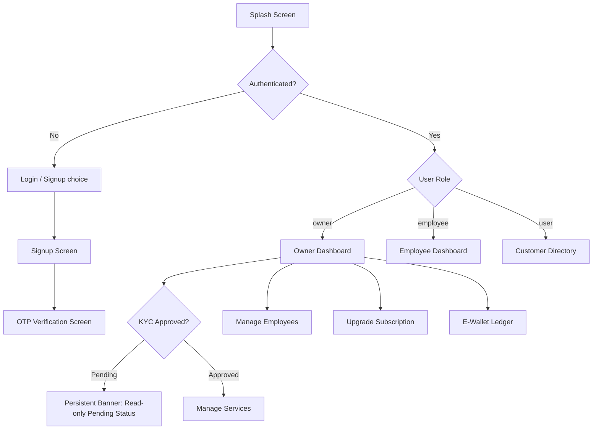

# Frontend Design Document: Quick Delivery Marketplace

This document outlines the architectural and user interface design for the Flutter frontend client of the Quick Delivery marketplace services platform. The frontend coordinates with the Go microservices backend exposed via the API Gateway.

> [!NOTE]
> **Planned vs. Current Architecture**: The directory structure and provider file tree detailed in Section 1 (such as `screens/shared/`, `screens/owner/`, `screens/employee/`, `screens/user/`, and `chat_provider.dart` / `sse_provider.dart`) represent the **target/planned architecture** for the production launch.
> The actual current frontend implementation consists of a flat screens directory (containing `employee_screen.dart`, `home_screen.dart`, `login_screen.dart`, `otp_screen.dart`, `signup_screen.dart`, and `wallet_screen.dart`) and is documented in [docs/frontend/STATUS.md](docs/frontend/STATUS.md). Please consult it for the current state of development.

---

## 1. Core Architecture

The frontend is structured as a single, multi-role Flutter application targeting mobile and web clients. It adopts a modular, clean architecture separated by layers: presentation (widgets/screens), business logic (state providers), and data (API clients and models).

```
frontend/
├── lib/
│   ├── main.dart                  # App initialization, routing setup, global providers
│   ├── core/                      # Global constants, theme, networking clients, utilities
│   │   ├── api_client.dart        # Base HTTP client supporting JWT token auth injection
│   │   ├── theme.dart             # Material 3 dark/light responsive design system tokens
│   │   └── constants.dart         # Backend gateway URLs and SSE/WebSocket endpoints
│   ├── models/                    # Data serialization classes matching Go models
│   │   ├── user.dart              # User profile & credentials
│   │   ├── job.dart               # Job tracker models
│   │   ├── service.dart           # Marketplace services
│   │   ├── wallet.dart            # Wallet and ledger entries
│   │   ├── subscription.dart      # Tenant subscriptions
│   │   └── notification.dart      # Real-time event notifications
│   ├── providers/                 # State management controllers (ChangeNotifiers)
│   │   ├── auth_provider.dart     # Authentication & registration logic
│   │   ├── job_provider.dart      # Job list, tracking, completion, and rating state
│   │   ├── chat_provider.dart     # WebSocket connection & real-time messaging
│   │   └── sse_provider.dart      # SSE notifications listener and dispatcher
│   └── screens/                   # Role-segregated UI views
│       ├── shared/                # Welcome, Login, Signup, OTP Verify, Chat Screens
│       ├── owner/                 # Owner Dashboard, Subscription, Employee Mgmt, Wallet
│       ├── employee/              # Employee Dashboard, Audit simulator
│       └── user/                  # Customer Service Directory, Service Detail, Job Tracker
```

### Stack Selection

1. **Framework**: Flutter (Dart) targeting cross-platform Web/Mobile.
2. **State Management**: `provider` (`^6.1.5`) for scoping authentication state, job lifecycle states, real-time chats, and notifications streams.
3. **HTTP Client**: `http` (`^1.6.0`) with custom request interceptors that inject the `Authorization` header containing the signed JWT token.
4. **WebSocket Protocol**: `web_socket_channel` (`^2.4.5`) for connecting to the real-time chat gateway (`ws://<gateway>:8080/api/v1/chat/ws?token=<jwt_token>`).
5. **SSE Stream Client**: `flutter_client_sse` (`^2.0.3`) for subscribing to real-time status alerts and job notifications via SSE (`http://<gateway>:8080/api/v1/notifications/stream?token=<jwt_token>`).

---

## 2. Visual Design & Theme System

To deliver a premium, modern experience, the app features a curated, high-contrast visual system aligned with Material 3 for the "Quick Delivery" (qd) brand identity.

*   **Primary Palette**: Deep Navy (`#0D1321`) as the primary dark/brand color, Amber Gold (`#FFC107`) as the primary accent/action color.
*   **Neutral Palette**: Light Gray (`#E5E7EB`) for backgrounds/dividers, White (`#FFFFFF`) for cards/surfaces.
*   **Typography**: Poppins (Bold / SemiBold / Regular / Medium weights) as the app-wide font family (replacing older placeholders like "Outfit" or "Inter").
*   **Logo/App Icon**: The "qd" wordmark with motion/speed lines preceding the letters, on a rounded-square dark navy background for the app icon.
*   **Alert Status**: Success Emerald (`#00E676`), Danger Coral (`#FF1744`), and Warning Orange (`#FF7A00`) — chosen to remain visually distinct and avoid clashing with the Amber Gold (`#FFC107`) brand accent.
*   **Micro-Animations**: Custom page transitions, hero elements on services/jobs, and fade/slide alert indicators using standard Flutter animation components (`AnimatedSwitcher`, `SlideTransition`).


---

## 3. Screen Flows by Role

The app dynamically switches navigation trees based on the logged-in user's role (`owner`, `employee`, `user`).



### Role Matrices & Permissions

| Role | Screens & View Permissions | Primary Interactivity |
| :--- | :--- | :--- |
| **Owner** | Dashboard, Subscription (Free/Paid), Manage Employees, Services Management, Jobs Overview, Wallet Ledger, Chat Screen. | Create services, Register employees, Toggle employee status, Book/complete jobs (COD-only), Rate employees, Upgrade subscription tier (paid tier requires manual activation). |
| **Employee** | Dashboard (Assigned Jobs), Audit Log Trail, Chat Screen, Rating Screen. | Simulate action logs (audit), chat on active jobs, rate owner after job completion. |
| **User (Customer)** | Service Directory (Spatial listing/sorting), Job Tracking Status, Chat Screen, Rating Screen, Notification Center. | Browse services, Book job (COD-only), Chat with assigned employee/owner, Rate job after completion. |

---

## 4. API Integration Details

The Flutter client interacts with backend microservices routed through the Gateway (`http://localhost:8080`).

### 1. Authentication Flow
- **Signup**: Calls [Signup handler](services/auth-service/internal/handlers/auth.go#L118) (`POST /api/v1/auth/signup`). Accepts `email`, `password`, `role`. Gated by signup-time anti-spam OTP; accounts are unconfirmed (`is_confirmed = false`) until the OTP is verified.
- **Login**: Calls [Login handler](services/auth-service/internal/handlers/auth.go#L330) (`POST /api/v1/auth/login`). Initiates authentication, sends/mocks a 6-digit OTP, and returns `dev_otp` in local development mode.
- **Verify OTP**: Calls [VerifyOTP handler](services/auth-service/internal/handlers/auth.go#L479) (`POST /api/v1/auth/verify-otp`). Activates the account and returns a signed HS256 JWT token.
- **Refresh Token**: Calls [Refresh handler](services/auth-service/internal/handlers/auth.go#L910) (`POST /api/v1/auth/refresh`). Reissues a new JWT token, validating that the old one expired no more than 7 days ago.
- **Header Structure**: All authenticated service endpoints require `Authorization: Bearer <JWT_TOKEN>`. The backend validates the HS256 signature and expiry locally using the shared `JWT_SECRET`.

### 2. Jobs & Services Flow
- **Browse**: Calls [ListServices](services/user-service/internal/handlers/handlers.go#L131) (`GET /api/v1/users/services?sort_by=price&near_by=true&lat=30&lon=31`).
- **Create Service**: Calls [CreateService](services/user-service/internal/handlers/handlers.go#L152) (`POST /api/v1/users/services`). Gated by [checkKYC](services/user-service/internal/handlers/handlers.go#L868) (Owner KYC must be approved).
- **Track/Book Job**: Calls [TrackJob](services/user-service/internal/handlers/handlers.go#L215) (`POST /api/v1/users/jobs/track`). Requires `payment_method: "cod"`. Other payment methods are blocked client-side.
- **Complete Job**: Calls [CompleteJob](services/user-service/internal/handlers/handlers.go#L433) (`POST /api/v1/users/jobs/complete`). For COD, requires `cash_collected: true`. Triggering completion automatically deducts the platform fee from the owner's e-wallet via [DeductCODFee](services/user-service/internal/store/mongodb.go#L492).
- **Cancel Job**: Calls `POST /api/v1/users/jobs/cancel`. Pending jobs can be cancelled by the owner or customer. Active jobs can only be cancelled by the owner; active cancellation by a customer is rejected with `403 Forbidden` (directing them to the complaint ticket flow). Cancellation of completed or already cancelled jobs is rejected with `409 Conflict`. For non-COD jobs, cancellation refunds the escrow amount back to the owner's withdrawable balance.

### 3. Subscription Flow
- **Upgrade**: Calls [Subscription POST](services/user-service/internal/handlers/handlers.go#L960) (`POST /api/v1/users/subscription`) with `tier: "paid"`. Returns `202 Accepted` and transitions to `pending_payment` status. The UI displays "upgrade pending, contact support" status.

### 4. Real-time Communications Flow
- **SSE Stream**: Subscribes to [Stream](services/notification-service/internal/handlers/handlers.go#L76) (`GET /api/v1/notifications/stream?token=<jwt_token>`). Pushes alerts client-side.
- **Chat WebSockets**: Connects to [HandleWebSocket](services/chat-service/internal/handlers/chat.go#L204) (`ws://localhost:8080/api/v1/chat/ws?token=<jwt_token>`).
  1. Sends subscription frame: `{"action":"subscribe", "channel":"job:<job_id>"}`.
  2. History fetch fallback: calls [GetHistory](services/chat-service/internal/handlers/chat.go#L288) (`GET /api/v1/chat/history?channel=job:<job_id>&limit=50`), which verifies channel access permissions.
  3. Sends messages: `{"action":"message", "channel":"job:<job_id>", "content":"..."}`.

---

## 5. Security & Rate Limiting

The application implements defense-in-depth across the API Gateway and microservices.

### 1. Rate Limiting & Lockout
- **Edge Rate Limiting**: The `api-gateway` enforces a sliding window rate limit of 100 requests per minute per client IP. IP addresses are extracted directly from `r.RemoteAddr` (rejecting external `X-Forwarded-For` and `X-Real-IP` at the edge to prevent IP spoofing). Lockout uses exponential backoff starting at 30 seconds, capping at 5 minutes.
- **Dual-Key Auth Lockout**: The `auth-service` implements dual-key rate limiting (on IP and Email) with exponential backoff starting at 30 seconds and capping at 5 minutes after 5 consecutive failures.
- **WebSocket Message Limiting**: The `chat-service` WebSocket connection rate limits incoming chat frames to 5 frames per minute per IP to prevent spamming.

### 2. Trust Boundaries & Authentication
- **Gateway Trust Validation**: The `auth-service` only trusts `X-Forwarded-For` headers from the API Gateway if the Gateway passes a verified, dynamically configured `GATEWAY_SECRET` header.
- **Internal Service Auth**: Communication between internal services is authenticated using a shared `X-Internal-Token` header containing `INTERNAL_SERVICE_TOKEN` values. Direct external calls using this header are stripped at the `api-gateway`.
- **Gating Policies**:
  - **KYC Gating**: Operations like service creation, wallet deposits, and job tracking are restricted to owners whose KYC status is explicitly `"approved"`.
  - **Tier-Based Gating**: Real-time employee location tracking is gated behind a Paid Subscription tier check (`plan: "paid"`) on the job owner. Location updates are throttled to a minimum 3-second interval per Job ID.
  - **Deactivated Employee Gating**: Assigning an employee to a new job (via TrackJob) verifies that their account is active (`is_active = true`) by querying auth-service. If deactivated, assignment is blocked with `400 Bad Request`. Deactivated employees are allowed to complete existing active jobs assigned to them before deactivation, allowing graceful completion of in-progress work without abrupt interruption.

---

## 6. Customer Service Outbound Chat Routing

This feature introduces a customer-service complaint channel reusing the existing `chat-service` WebSocket/channel infrastructure. It routes requests to available customer-service support agents instead of a specific employee, without adding a 4th role to the core authentication matrix.

### 1. Database Model & Collections
- **`complaint_tickets`**: Tracks individual complaints.
  - `ticket_id` (string/`_id`): Unique ID (`tkt-<unixnano>`).
  - `customer_id` (string): Customer who filed the complaint.
  - `context_id` (string): The job/context identifier associated with the complaint.
  - `status` (string): `"pending"` (queued), `"assigned"`, `"resolved"`, or `"closed"`.
  - `assigned_agent_id` (string): The ID of the assigned support agent.
  - `created_at` / `assigned_at` (timestamps).
- **`support_agents`**: Tracks support agent states and tokens.
  - `agent_id` (string/`_id`): The unique support agent identifier.
  - `status` (string): `"available"`, `"busy"`, or `"offline"`.
  - `token` (string): Scoped agent-specific credential for authentication (verified in the database).
  - `current_ticket_id` (string): The ticket ID currently assigned to the agent.

### 2. Atomic Agent Assignment Design
To prevent concurrency issues where two concurrent tickets are assigned to the same agent, the assignment is executed in a **single atomic database operation** using MongoDB's `FindOneAndUpdate`:
- It searches for an agent with `status: "available"`.
- It atomically sets their `status` to `"busy"` and associates the `current_ticket_id`.
- If no agent is found (`mongo.ErrNoDocuments`), the ticket remains in `"pending"` (queued) status.

> [!IMPORTANT]
> **Timeout-Based Mitigations Rejected**: Timing-based solutions (such as a 2-second timeout between tickets) were explicitly rejected as insufficient because they do not protect against deliberate race-condition attacks. The single atomic database update guarantees mutual exclusion by design.

### 3. Authentication & Scoping (IDOR Protection)
- **Scoped Identity**: Support agents authenticate using distinct tokens (passed via `?token=` parameter) matched directly against the `support_agents` collection, separate from the customer JWT flow.
- **Access Scoping**: Channels for complaints use the prefix `ticket:<ticket_id>`. In `canAccessChannel`, a user is authorized *only* if they are the ticket's `customer_id` or the `assigned_agent_id`. This prevents support agents or other customers from accessing tickets they are not assigned/related to, mitigating IDOR threats.

### 4. Out-of-Band Agent Onboarding
To maintain a minimized attack surface on the running services, onboarding a support agent is deliberately designed as a **standalone out-of-band CLI tool** rather than an HTTP application endpoint.
- **Zero Running Attack Surface**: Because the `chat-service` only ever reads from the `support_agents` collection (and never needs to create/onboard agents at runtime), there is no code path or endpoint in the running application for registering support agents.
- **Secure Token Generation**: The tool runs operations locally/administratively, connecting directly to MongoDB. It generates a cryptographically secure token, writes it to the database, and prints it once to stdout.


