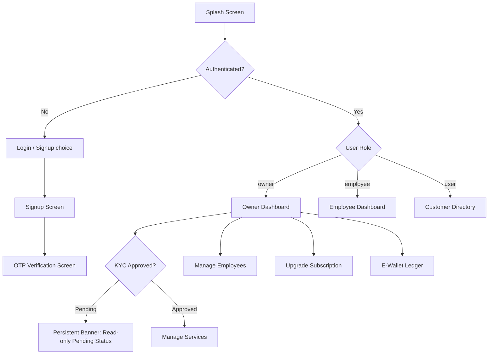

# Frontend Design Document: saas-core Marketplace

This document outlines the architectural and user interface design for the Flutter frontend client of the `saas-core` marketplace services platform. The frontend coordinates with the Go microservices backend exposed via the API Gateway.

---

## 1. Core Architecture

The frontend is structured as a single, multi-role Flutter application targeting mobile and web clients. It adopts a modular, clean architecture separated by layers: presentation (widgets/screens), business logic (state providers), and data (API clients and models).

```
frontend/
├── lib/
│   ├── main.dart                  # App initialization, routing setup, global providers
│   ├── core/                      # Global constants, theme, networking clients, utilities
│   │   ├── api_client.dart        # Base HTTP client supporting raw user_id auth injection
│   │   ├── theme.dart             # Material 3 dark/light responsive design system tokens
│   │   └── constants.dart         # Backend gateway URLs and SSE/WebSocket endpoints
│   ├── models/                    # Data serialization classes matching Go models
│   │   ├── user.dart              # User profile & credentials
│   │   ├── job.dart               # Job tracker models
│   │   ├── service.dart           # Marketplace services
│   │   ├── wallet.dart            # Wallet and ledger entries
│   │   ├── subscription.dart      # Tenant subscriptions
│   │   └── notification.dart      # Real-time event notifications
│   ├── providers/                 # State management controllers (ChangeNotifiers)
│   │   ├── auth_provider.dart     # Authentication & registration logic
│   │   ├── job_provider.dart      # Job list, tracking, completion, and rating state
│   │   ├── chat_provider.dart     # WebSocket connection & real-time messaging
│   │   └── sse_provider.dart      # SSE notifications listener and dispatcher
│   └── screens/                   # Role-segregated UI views
│       ├── shared/                # Welcome, Login, Signup, OTP Verify, Chat Screens
│       ├── owner/                 # Owner Dashboard, Subscription, Employee Mgmt, Wallet
│       ├── employee/              # Employee Dashboard, Audit simulator
│       └── user/                  # Customer Service Directory, Service Detail, Job Tracker
```

### Stack Selection

1. **Framework**: Flutter (Dart) targeting cross-platform Web/Mobile.
2. **State Management**: `provider` (`^6.1.5`) for scoping authentication state, job lifecycle states, real-time chats, and notifications streams.
3. **HTTP Client**: `http` (`^1.6.0`) with custom request interceptors that inject the `Authorization` header containing the user's ID as the raw authentication token.
4. **WebSocket Protocol**: `web_socket_channel` (`^2.4.5`) for connecting to the real-time chat gateway (`ws://<gateway>:8080/api/v1/chat/ws`).
5. **SSE Stream Client**: `flutter_client_sse` (`^1.0.0`) for subscribing to real-time status alerts and job notifications via SSE (`http://<gateway>:8080/api/v1/notifications/stream`).

---

## 2. Visual Design & Theme System

To deliver a premium, modern experience, the app will feature a curated, high-contrast visual system aligned with Material 3.

*   **Primary Palette**: Deep Indigo (`#3F51B5`) and Electric Violet (`#7C4DFF`).
*   **Backgrounds (Dark Mode)**: Pure Charcoal Black (`#121212`) and Sleek Slate (`#1E1E2C`) with glassmorphism card overlays.
*   **Alert Status**: Success Emerald (`#00E676`), Danger Coral (`#FF1744`), Warning Amber (`#FFC400`).
*   **Typography**: Google Font "Outfit" or "Inter" as the default font family for dynamic, clean header presentation.
*   **Micro-Animations**: Custom page transitions, hero elements on services/jobs, and fade/slide alert indicators using standard Flutter animation components (`AnimatedSwitcher`, `SlideTransition`).

---

## 3. Screen Flows by Role

The app dynamically switches navigation trees based on the logged-in user's role (`owner`, `employee`, `user`).



### Role Matrices & Permissions

| Role | Screens & View Permissions | Primary Interactivity |
| :--- | :--- | :--- |
| **Owner** | Dashboard, Subscription (Free/Paid), Manage Employees, Services Management, Jobs Overview, Wallet Ledger, Chat Screen. | Create services, Register employees, Toggle employee status, Book/complete jobs (COD-only), Rate employees, Upgrade subscription tier (paid tier requires manual activation). |
| **Employee** | Dashboard (Assigned Jobs), Audit Log Trail, Chat Screen, Rating Screen. | Simulate action logs (audit), chat on active jobs, rate owner after job completion. |
| **User (Customer)** | Service Directory (Spatial listing/sorting), Job Tracking Status, Chat Screen, Rating Screen, Notification Center. | Browse services, Book job (COD-only), Chat with assigned employee/owner, Rate job after completion. |

---

## 4. API Integration Details

The Flutter client interacts with backend microservices routed through the Gateway (`http://localhost:8080`).

### 1. Authentication Flow
- **Signup**: Calls [Signup handler](file:///mnt/windows_data/CS%20tools/Antigravity/SaaS%20prototype/services/auth-service/internal/handlers/auth.go#L70) (`POST /api/v1/auth/signup`). Accepts `email`, `password`, `role`. If `employee`, requires `owner_id` (KYE binding).
- **Login**: Calls [Login handler](file:///mnt/windows_data/CS%20tools/Antigravity/SaaS%20prototype/services/auth-service/internal/handlers/auth.go#L223) (`POST /api/v1/auth/login`). Returns `dev_otp` in development.
- **Verify OTP**: Calls [VerifyOTP handler](file:///mnt/windows_data/CS%20tools/Antigravity/SaaS%20prototype/services/auth-service/internal/handlers/auth.go#L351) (`POST /api/v1/auth/verify-otp`). Authenticates the user and fetches user parameters.
- **Header Structure**: All authenticated service endpoints require `Authorization: Bearer <user_id>` (which uses the Go backend's query param / header lookup mapping).

### 2. Jobs & Services Flow
- **Browse**: Calls [ListServices](file:///mnt/windows_data/CS%20tools/Antigravity/SaaS%20prototype/services/user-service/internal/handlers/handlers.go#L65) (`GET /api/v1/users/services?sort_by=price&near_by=true&lat=30&lon=31`).
- **Create Service**: Calls [CreateService](file:///mnt/windows_data/CS%20tools/Antigravity/SaaS%20prototype/services/user-service/internal/handlers/handlers.go#L86) (`POST /api/v1/users/services`). Gated by [checkKYC](file:///mnt/windows_data/CS%20tools/Antigravity/SaaS%20prototype/services/user-service/internal/handlers/handlers.go#L535) (Owner KYC must be approved).
- **Track/Book Job**: Calls [TrackJob](file:///mnt/windows_data/CS%20tools/Antigravity/SaaS%20prototype/services/user-service/internal/handlers/handlers.go#L133) (`POST /api/v1/users/jobs/track`). Requires `payment_method: "cod"`. Other payment methods are blocked client-side.
- **Complete Job**: Calls [CompleteJob](file:///mnt/windows_data/CS%20tools/Antigravity/SaaS%20prototype/services/user-service/internal/handlers/handlers.go#L250) (`POST /api/v1/users/jobs/complete`). For COD, requires `cash_collected: true`. Triggering completion automatically deducts the platform fee from the owner's e-wallet via [DeductCODFee](file:///mnt/windows_data/CS%20tools/Antigravity/SaaS%20prototype/services/user-service/internal/store/memory.go#L295).

### 3. Subscription Flow
- **Upgrade**: Calls [Subscription POST](file:///mnt/windows_data/CS%20tools/Antigravity/SaaS%20prototype/services/user-service/internal/handlers/handlers.go#L588) (`POST /api/v1/users/subscription`) with `tier: "paid"`. Returns `202 Accepted` and transitions to `pending_payment` status. The UI displays "upgrade pending, contact support" status.

### 4. Real-time Communications Flow
- **SSE Stream**: Subscribes to [Stream](file:///mnt/windows_data/CS%20tools/Antigravity/SaaS%20prototype/services/notification-service/internal/handlers/handlers.go#L47) (`GET /api/v1/notifications/stream?token=<user_id>`). Pushes alerts client-side.
- **Chat WebSockets**: Connects to [HandleWebSocket](file:///mnt/windows_data/CS%20tools/Antigravity/SaaS%20prototype/services/chat-service/internal/handlers/chat.go#L149) (`ws://localhost:8080/api/v1/chat/ws?token=<user_id>`).
  1. Sends subscription frame: `{"action":"subscribe", "channel":"job:<job_id>"}`.
  2. History fetch fallback: calls [GetHistory](file:///mnt/windows_data/CS%20tools/Antigravity/SaaS%20prototype/services/chat-service/internal/handlers/chat.go#L203) (`GET /api/v1/chat/history?channel=job:<job_id>&limit=50`).
  3. Sends messages: `{"action":"message", "channel":"job:<job_id>", "content":"..."}`.
