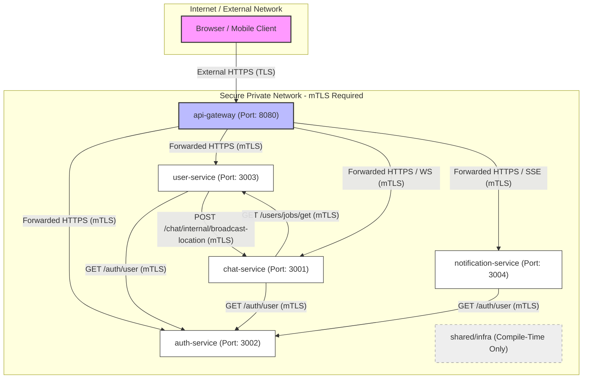

# Quick Delivery — Complete Application Map

> [!NOTE]
> **Reflects Repository State**: This document maps the application architecture, APIs, inter-service connections, and actor flows as of Git commit: **`f3404b4`**.
> Since the codebase is subject to ongoing development, this map should be regenerated and re-verified via `git rev-parse --short HEAD` after significant routing or security changes.

---

## Connection Diagram

The following diagram visualizes the trust boundary and inter-service connections across the application. External client traffic enters solely through the API Gateway, which acts as the SSL-termination edge and proxies to internal services via mTLS.



---

## Section 1: Service Inventory

The platform is comprised of **5 microservices** and **1 compile-time shared package**. Below is the detailed inventory of each component, its database ownership, port mappings, and HTTP routing policies.

### 1. `api-gateway` (Port: `8080`)
* **Core Responsibility**: The public-facing reverse proxy and routing edge for all client-facing traffic. Terminals SSL/TLS on the internet boundary, enforces edge rate limiting via Redis, rewrites request paths, and strips unsafe incoming headers.
* **Database & Collections**: None. Maintains edge rate limit buckets inside Redis.
* **Security & TLS Policy**: 
  * Inbound: Serves public traffic over HTTPS (`http.ListenAndServeTLS` using `EXTERNAL_TLS_CERT_PATH` and `EXTERNAL_TLS_KEY_PATH`).
  * Outbound: Calls downstream services using mTLS (`tlsutil.LoadClientTLSConfig`).
* **Header Handling**: 
  * Strips/deletes incoming `X-Internal-Token` headers from callers.
  * Overwrites `X-Forwarded-For` with the client’s remote address.
  * Injects `X-Gateway-Secret` to authenticate gateway-proxied requests.
* **Outbound HTTP Calls**:
  * `auth-service`: Matches prefix `/api/v1/auth/` and forwards to `http://auth-service:3002`.
  * `user-service`: Matches prefix `/api/v1/users/` and forwards to `http://user-service:3003`.
  * `chat-service`: Matches prefix `/api/v1/chat/` and forwards to `http://chat-service:3001`.
  * `notification-service`: Matches prefix `/api/v1/notifications/stream` and forwards to `http://notification-service:3004`.

### 2. `auth-service` (Port: `3002`)
* **Core Responsibility**: Manages user profiles, credentials, 2FA OTP codes, employee activations, session verification, and audit logs.
* **Database & Collections**: MongoDB (`auth_db`):
  * `users`: Stores emails, role types, hashed passwords (bcrypt), KYC states, and OTP secrets.
  * `audit_logs`: Records simulated employee actions and administrative tasks.
* **Security & TLS Policy**: Internal mTLS-only server.
* **Inbound HTTP calls**:
  * `api-gateway` (public routes).
  * `chat-service` (calls `/auth/user` to authenticate WebSockets).
  * `notification-service` (calls `/auth/user` to authenticate SSE streams).
  * `user-service` (calls `/auth/user` to verify KYC status).
* **Outbound HTTP calls**: None.

### 3. `chat-service` (Port: `3001`)
* **Core Responsibility**: Real-time communication server. Hosts WebSockets for active chat channels (segregated per job/ticket), manages location broadcasts, and coordinates support agent ticket assignments.
* **Database & Collections**: MongoDB (`chat_db`):
  * `chat_messages`: Stores message history for channels.
  * `complaint_tickets`: Stores complaint ticket states and assigned agents.
  * `support_agents`: Stores onboarded support agents and active session tokens.
* **Security & TLS Policy**: Serves mTLS HTTPS API routes and upgrades client WebSocket connections.
* **Inbound HTTP calls**:
  * `api-gateway` (public routes).
  * `user-service` (calls `/chat/internal/broadcast-location`).
* **Outbound HTTP calls**:
  * `auth-service`: Queries `/auth/user?id=<user_id>` to authenticate WebSocket connections.
  * `user-service`: Queries `GET /users/jobs/get?id=<job_id>` to resolve job owner, employee, and customer relationships for channel access control.

### 4. `notification-service` (Port: `3004`)
* **Core Responsibility**: Server-Sent Events (SSE) notification hub. Streams real-time popups and tenant-wide job alerts to connected web/mobile clients.
* **Database & Collections**: None. SSE connections are held in-memory within the active Hub.
* **Security & TLS Policy**: Serves mTLS HTTPS API routes and maintains SSE streams.
* **Inbound HTTP calls**:
  * `api-gateway` (public `/notifications/stream` routes).
  * `user-service` (invokes `/notifications/send` and `/notifications/broadcast/job-alert` internally).
* **Outbound HTTP calls**:
  * `auth-service`: Queries `/auth/user?id=<user_id>` to verify connecting SSE client tokens.

### 5. `user-service` (Port: `3003`)
* **Core Responsibility**: Manages the marketplace services directory (with spatial queries), active job lifecycles, wallets, ledgers, subscriptions, and provider ratings.
* **Database & Collections**: MongoDB (`user_db`):
  * `services`: Stores list of provider service listings with `2dsphere` coordinates.
  * `jobs`: Stores active jobs, statuses, tracking coordinates, and transaction references.
  * `wallets`: Stores tenant e-wallet balances (`total_balance`, `withdrawable_balance`).
  * `ledger`: Stores accounting journal entries for auditability.
  * `subscriptions`: Stores tenant subscription statuses and plans.
  * `ratings`: Stores double-blind ratings and stars.
* **Security & TLS Policy**: Internal mTLS-only server.
* **Inbound HTTP calls**:
  * `api-gateway` (public routes).
  * `chat-service` (queries `/users/jobs/get?id=<job_id>`).
* **Outbound HTTP calls**:
  * `auth-service`: Queries `/auth/user?id=<owner_id>` to verify owner KYC status.
  * `chat-service`: Queries `POST /chat/internal/broadcast-location` to publish live driver coordinates.

### 6. `shared/infra` (Compile-time dependency)
* **Core Responsibility**: Consolidates common code dependencies (saving duplicate lines in monorepo).
* **Libraries**:
  * `jwtutil`: Validates/generates signed JWT credentials.
  * `ratelimit`: Redis-backed sliding-window rate limiters.
  * `resilience`: Circuit breakers (`gobreaker`) and retries.
  * `tlsutil`: Configures internal mTLS handshakes.
  * `handlerutil`: Ships structured logs and security events.

---

## Section 2: Complete Endpoint Table

All HTTP endpoints registered across the services are listed below, cross-referenced with their actual routing definitions.

> [!NOTE]
> **Request Parameter Naming Compatibility**: To address naming clarity issues where request fields expected signed JWT tokens rather than raw database IDs, the Go backend supports newer `_token` aliases alongside legacy parameter names (preferring `_token` if both are present).
> 
> | Legacy Field Name | New Preferred Alias | Affected Endpoints |
> |---|---|---|
> | `user_id` / `id` | `user_token` | GET /auth/user, GET /auth/user/public-profile, POST /users/jobs/track, GET /users/ratings |
> | `owner_id` | `owner_token` | POST /users/services, POST /users/jobs/track |
> | `employee_id` | `employee_token` | POST /users/jobs/track, GET /users/jobs/get |
> | `requester_id` | `requester_token` | GET /auth/audit-log, GET /auth/user/public-profile, GET /users/jobs/get, POST /users/jobs/complete, POST /users/jobs/cancel, POST /users/subscription, POST /users/jobs/location/update |
> | `tenant_id` | `tenant_token` | GET /users/wallet, POST /users/wallet/deposit, GET /users/ledger, GET /users/subscription, POST /users/subscription |
> | `rated_by` / `rated_user` | `rated_by_token` / `rated_user_token` | POST /users/jobs/rate |

<!-- GENERATED:ENDPOINTS:START -->
| Method + Path | Owning Service | Caller Permissions | Core Functionality | Read / Write Target & Downstream Actions |
| :--- | :--- | :--- | :--- | :--- |
| **`GET /`** | `api-gateway` | Public | Root index. | None. |
| **`GET /health`** | `api-gateway` | Public | Public gateway health status. | None. |
| **`GET /health/internal`** | `api-gateway` | `X-Internal-Token` | Returns circuit breaker metrics. | Reads breaker memory. |
| **`GET /auth/audit-log`** | `auth-service` | Tenant Owner JWT | Fetches tenant security audit logs. Accepts requester_id (legacy) or requester_token (preferred). | Reads `audit_logs` collection. |
| **`GET /auth/documents/view`** | `auth-service` | Reviewer Token & `X-Internal-Token` | Validates signed URL token and streams/serves the uploaded document file. | Streams file content. |
| **`POST /auth/employee/action`** | `auth-service` | Target Employee JWT | Records a simulated worker activity. | Writes `audit_logs` collection. |
| **`POST /auth/employee/toggle`** | `auth-service` | Owner JWT (KYC Approved) | Activates/deactivates employee account. | Reads `users` (owner/employee), updates `users`. |
| **`GET /auth/employees`** | `auth-service` | Owner JWT | GetEmployees returns all employees registered under the caller's tenant owner account. | Reads `users` collection by `tenant_id`. Returns JSON array of `EmployeeResponse` (`ID`, `Username`, `Email`, `IsActive`, `CreatedAt`). Rate-limited per owner ID. |
| **`GET /auth/kyb-kye/pending`** | `auth-service` | Reviewer Token & `X-Internal-Token` | Fetches pending KYB verification submissions (including username). | Reads `users` and `reviewers` collections. |
| **`POST /auth/kyb-kye/review`** | `auth-service` | Reviewer Token & `X-Internal-Token` | Approves or rejects KYB submissions. | Updates `users` status. Writes `audit_logs` and `reviewers`. |
| **`POST /auth/kyb/upload`** | `auth-service` | Owner JWT | Uploads KYB verification files (ID front/back, selfie, business proof). | Writes uploaded documents to local storage. Updates `users` collection. |
| **`POST /auth/kye/upload`** | `auth-service` | Employee JWT | Uploads KYE verification files (ID front/back, selfie). | Writes uploaded documents to local storage. Updates `users` collection. |
| **`POST /auth/login`** | `auth-service` | Public (via Gateway) | Logs in user, dispatches 2FA OTP. | Reads/writes `users` collection (OTP/attempts). Writes `audit_logs`. |
| **`POST /auth/logout`** | `auth-service` | Bearer JWT | Logs out user, revokes JWT session. | Writes token JTI to Redis denylist. |
| **`POST /auth/refresh`** | `auth-service` | Public (via Gateway) | Refreshes active JWT sessions. | None. |
| **`POST /auth/resend-otp`** | `auth-service` | Public | ResendOTP handles resending a fresh OTP for unconfirmed accounts. | Reads `users` collection by email, updates `otp_code` and `otp_expires_at` fields. |
| **`POST /auth/signup`** | `auth-service` | Public (via Gateway) | Registers a new tenant or user. | Writes `users` collection. Logs OTP code. |
| **`GET /auth/user`** | `auth-service` | `X-Internal-Token` OR User JWT | Resolves user profile (including username) and role details. Accepts id (legacy) or user_token (preferred). | Reads `users` collection. |
| **`GET /auth/user/public-profile`** | `auth-service` | User JWT | Returns only non-sensitive, public profile fields (ID and username). Accepts id (legacy) or user_token (preferred), and requester_id (legacy) or requester_token (preferred). | Reads `users` collection. |
| **`POST /auth/verify-otp`** | `auth-service` | Public (via Gateway) | Validates 2FA OTP, issues JWT. | Reads/writes `users` collection. Writes `audit_logs`. |
| **`GET /chat/history`** | `chat-service` | Channel Member JWT | Retrieves channel chat history (containing sender_username point-in-time snapshot). | Reads `chat_messages` collection. Downstream: calls `user-service/users/jobs/get`. |
| **`POST /chat/internal/broadcast-location`** | `chat-service` | `X-Internal-Token` | Broadcasts driver location event. | None. |
| **`POST /chat/tickets`** | `chat-service` | User JWT | Submits complaint ticket & assigns agent. | Reads/writes `complaint_tickets` and `support_agents` (atomic). |
| **`POST /chat/tickets/resolve`** | `chat-service` | Support Agent Token | Resolves ticket & releases agent status. | Updates `complaint_tickets` and `support_agents`. |
| **`GET /chat/ws`** | `chat-service` | User JWT OR Agent Token | WebSocket connection upgrade path. | Reads `support_agents` (for agent tokens). Downstream: calls `auth-service/auth/user`. |
| **`POST /notifications/broadcast/job-alert`** | `notification-service` | `X-Internal-Token` | Broadcasts job alert to employees. | Dispatches message to SSE clients. |
| **`POST /notifications/send`** | `notification-service` | `X-Internal-Token` | Sends a targeted popup alert. | Dispatches message to SSE client. |
| **`GET /notifications/stream`** | `notification-service` | User JWT | Opens SSE channel for alerts. | Downstream: calls `auth-service/auth/user`. |
| **`POST /users/jobs/cancel`** | `user-service` | Owner JWT (KYC Approved) | Cancels an active job and processes escrow refunds. Accepts requester_id (legacy) or requester_token (preferred). | Updates `jobs` collection. Updates `wallets` and `ledger` collections. |
| **`POST /users/jobs/complete`** | `user-service` | Owner or Employee JWT | Completes active job, processes fees. Accepts requester_id (legacy) or requester_token (preferred) in body or query. | Updates `jobs`, writes `wallets`, writes `ledger`. |
| **`GET /users/jobs/get`** | `user-service` | `X-Internal-Token` OR User JWT | Resolves detailed job configuration (single job by ID) or lists jobs. Accepts id (legacy) or user_token (preferred), requester_id (legacy) or requester_token (preferred), and employee_id (legacy) or employee_token (preferred). | Reads `jobs` collection. Enforces IDOR protection: if `employee_id` query param is provided, it must match the employee identity strictly resolved from the JWT token. |
| **`POST /users/jobs/location/update`** | `user-service` | Employee JWT | Updates driver coordinates. Accepts requester_id (legacy) or requester_token (preferred). | Reads `jobs`, updates `jobs`. Downstream: calls `chat-service/chat/internal/broadcast-location`. |
| **`GET /users/jobs/mine`** | `user-service` | Customer JWT | Lists all jobs booked by the authenticated customer (DTO: CustomerJobResponse). Supports optional user_id parameter matching for IDOR validation. | Reads `jobs` collection. Rate-limited per customer identity (30 req/min). |
| **`GET /users/jobs/owner`** | `user-service` | Owner JWT | Lists all jobs owned by the authenticated tenant owner (DTO: OwnerJobResponse). Supports optional owner_id parameter matching for IDOR validation. | Reads `jobs` collection. Rate-limited per owner identity (30 req/min). |
| **`POST /users/jobs/rate`** | `user-service` | Owner or Employee JWT | Submits a double-blind rating. Accepts rated_by (legacy) or rated_by_token (preferred), and rated_user (legacy) or rated_user_token (preferred). | Writes `ratings`, updates `jobs`. |
| **`POST /users/jobs/track`** | `user-service` | Owner/Employee JWT (legacy tracking) OR Customer JWT + service_id (owner resolved server-side; supports optional employee pre-assignment) | Books job with coordinate validation. Accepts user_id (legacy) or user_token (preferred), owner_id (legacy) or owner_token (preferred), and employee_id (legacy) or employee_token (preferred). | Downstream: calls `auth-service/auth/user`. Writes `jobs`. |
| **`GET /users/ledger`** | `user-service` | Owner JWT | Lists financial ledger records. Accepts tenant_id (legacy) or tenant_token (preferred). | Reads `ledger` collection. |
| **`GET /users/platform/config`** | `user-service` | Public | Fetches global fees configuration. | Reads `platform_config` collection. |
| **`GET /users/ratings`** | `user-service` | User JWT | Returns ratings count and average. Accepts user_id (legacy) or user_token (preferred). | Reads `ratings` collection. |
| **`GET /users/services`** | `user-service` | Public | Spatial search on services directory. | Reads `services` collection. |
| **`POST /users/services`** | `user-service` | Owner JWT (KYC Approved) | Inserts service listing. | Downstream: calls `auth-service/auth/user`. Writes `services` collection. |
| **`POST /users/subscription`** | `user-service` | Owner JWT (KYC Approved) | Subscribes/renews SaaS tier. Accepts tenant_id (legacy) or tenant_token (preferred), and requester_id (legacy) or requester_token (preferred). | Updates `subscriptions`, writes `wallets`, writes `ledger`. |
| **`GET /users/wallet`** | `user-service` | Owner JWT | Fetches active balance details. Accepts tenant_id (legacy) or tenant_token (preferred). | Reads `wallets` collection. |
| **`POST /users/wallet/deposit`** | `user-service` | Owner JWT | Loads funds up to maximum limits. Accepts tenant_id (legacy) or tenant_token (preferred). | Updates `wallets` collection. |
<!-- GENERATED:ENDPOINTS:END -->

### Standalone Operations (CLI Tool)
* **`onboard-agent` CLI** (`services/chat-service/cmd/onboard-agent/main.go`):
  * **Caller Permissions**: Standard Linux CLI execution with MongoDB credentials. Not exposed as an HTTP endpoint.
  * **Core Functionality**: Safe onboarding of support agents. Validates uniqueness, generates secure 32-byte hex credentials, and writes the record to the `support_agents` database.
  * **Read/Write**: Writes `support_agents` collection.
* **`onboard-reviewer` CLI** (`services/auth-service/cmd/onboard-reviewer/main.go`):
  * **Caller Permissions**: Standard Linux CLI execution with MongoDB credentials. Not exposed as an HTTP endpoint.
  * **Core Functionality**: Safe onboarding of super-admin KYB/KYE document reviewers. Validates uniqueness, generates secure 32-byte hex credentials, and writes the record to the `reviewers` database.
  * **Read/Write**: Writes `reviewers` collection.

---

## Section 3: Actor-Centric Flows

Below are the step-by-step transaction lifecycles for each user role on the platform, illustrating the sequence of backend requests.

### 1. Tenant Owner Flow (Setup & Directory Listing)
1. **Signup**: Caller triggers `POST /auth/signup` with role `"owner"`.
   * *Status*: Account created but flag `is_confirmed = false`.
   * *2FA SMS / Email Dispatch*: Mocked in code. It logs the OTP to stdout and exposes it as `dev_otp` in the JSON response in local environments.
2. **OTP Verification**: Caller triggers `POST /auth/verify-otp` with the OTP code.
   * *Status*: Account is verified (`is_confirmed = true`), returning a signed JWT token.
3. **KYC Approval**: Owner KYC status default is `"pending_super_admin_approval"`. 
   * *Verification*: Since no administrative endpoint exists, KYC status must be approved manually by an operations engineer in the database (`db.users.updateOne({_id: "..."}, {$set: {kyc_status: "approved"}})`).
4. **Create Service Listing**: Owner triggers `POST /users/services` with their JWT token.
   * *Validation*: `user-service` calls `auth-service/auth/user` internally to check if the owner's KYC status is `"approved"`. Writes listing to `services`.
5. **Purchase Subscription**: Owner triggers `POST /users/subscription` with JWT to register for a SaaS plan.
   * *Validation*: Checks wallet has sufficient funds, deducts subscription cost, and writes record to `subscriptions` and `ledger` collections.

### 2. Job Lifecycle Flow (Owner & Employee & Customer)
1. **Job Booking**: Tenant Owner (legacy tracking) OR Customer (marketplace booking) calls `POST /users/jobs/track` with JWT.
   * *Owner Resolution*: If booked by a customer without an owner token, the backend securely loads the service record from the database by its `service_id` and resolves the owner ID server-side (`svc.TenantID`) to prevent owner-ID spoofing. If an owner token is explicitly provided (owner/employee-initiated tracking), the backend validates the token and cross-checks that the owner matches the service's tenant, rejecting mismatches with a `403 Forbidden` error.
   * *Employee Pre-Assignment*: If an `employee_id` is supplied to pre-assign an employee, the backend validates that the employee is active, holds the employee role, and belongs to the resolved owner's tenant (whether the owner is resolved from the owner token or server-side from the service record for customer-initiated bookings).
   * *Validation*: Checks that the resolved Owner KYC status is `"approved"`.
   * *Constraint*: The endpoint rejects any payment method other than `"cod"` (Cash on Delivery) in non-local environments.
   * *Alerting*: It broadcasts a job alert to nearby employees (logged in stdout / stubbed).
2. **Job Assignment**: Job is assigned to an active employee.
3. **Location Updates (Driver tracking)**: While driving, the Employee client triggers `POST /users/jobs/location/update` with their Employee JWT.
   * *Validation*: `user-service` verifies the Owner's subscription tier is active and enforces a **3-second throttling minimum** between requests.
   * *Action*: Coordinates are saved to MongoDB and broadcasted via `POST /chat/internal/broadcast-location` (mTLS) to the `chat-service` WebSocket hub.
4. **Job Completion**: The Owner or Employee triggers `POST /users/jobs/complete` confirming cash collection.
   * *Deduction*: The system computes the platform fee (e.g. 15%) from the final price and deducts it from the Owner's e-wallet (allowing a negative balance). Writes `ledger` and `wallets` documents.
5. **Rating**: Owner or Employee triggers `POST /users/jobs/rate` within 2FA session. Checks that job status is `"completed"` and limits users to **one rating per job** (enforced by a compound unique index in MongoDB).

### 3. Customer Service Flow (User & Support Agent)
1. **Ticket Creation**: User triggers `POST /chat/tickets` with JWT.
   * *Atomic Assignment*: The `chat-service` performs an atomic transaction (`FindOneAndUpdate`) looking for an available agent (status `"available"`). If found, it marks the agent as `"busy"` and assigns their ID to the ticket. If no agent is available, the ticket queues as `"pending"`.
2. **WebSocket Communication**: Both the User and the Support Agent connect to `chat-service/chat/ws`.
   * *Agent Auth*: Agent authenticates using the secure token printed during the CLI onboarding.
   * *Access Gating*: Users can only access channel `"ticket:<ticket_id>"` if they own the ticket or are the assigned agent.
3. **Resolution**: The assigned agent triggers `POST /chat/tickets/resolve`.
   * *Validation*: An IDOR check verifies that the caller's agent ID matches the ticket's assigned agent ID.
   * *Action*: Marks ticket as `"resolved"`, sets agent status back to `"available"`.

---

## Section 4: Data Flow for Sensitive Operations

Detailed execution paths for transactions requiring absolute auditing integrity:

### 1. Wallet & COD Fee Handling
```
[Owner/Employee Client] 
         │
         ▼
POST /users/jobs/complete  ──► (Validates JWT, Checks payment_method == "cod")
         │
         ▼
[user-service] ──────────────► (Fetches global PlatformConfig for fee %)
         │
         ▼
[user-service Store] ────────► DeductCODFee()
         │
         ├──► Increment platform wallet balance in MongoDB
         ├──► Decrement owner wallet balance in MongoDB (allows negative balance)
         └──► Insert TransactionLedger entry {"id": "tx-<timestamp>-fee", ...}
```

### 2. KYC / KYB Gating
```
[Client Request]
         │ (e.g. POST /users/services)
         ▼
   [user-service]
         │
         ▼ (GET /auth/user?id=<owner_id> with X-Internal-Token)
   [auth-service]
         │
         ▼ (Reads 'users' collection in MongoDB)
   [auth-service] ───────────► Returns KYCStatus ("approved" | "pending_super_admin_approval")
         │
         ▼
   [user-service]
         │
         ├──► If KYCStatus == "approved" ──────────────────► Allow execution (write to MongoDB)
         └──► If KYCStatus == "pending_super_admin_approval" ► Block with 403 Forbidden
```

### 3. Double-Blind Rating System
```
[Client Request] (POST /users/jobs/rate)
         │
         ▼
   [user-service] ───────────► (Validates JWT tokens for RatedBy and RatedUser)
         │
         ▼
   [user-service] ───────────► (Checks Job collection: JobStatus == "completed")
         │
         ▼
   [user-service] ───────────► (Enforces Rating Authorization: RatedBy and RatedUser 
         │                      must map to Job's OwnerID and EmployeeID)
         ▼
   [user-service Store] ─────► CreateRating()
         │
         ▼ (Writes to MongoDB 'ratings' collection)
   [MongoDB Index] ──────────► Compound unique index {job_id: 1, rated_by: 1}
         │
         ├──► Success ───────► Return 201 Created
         └──► Duplicate ─────► Catch WriteError 11000, abort & return 409 Conflict
```
