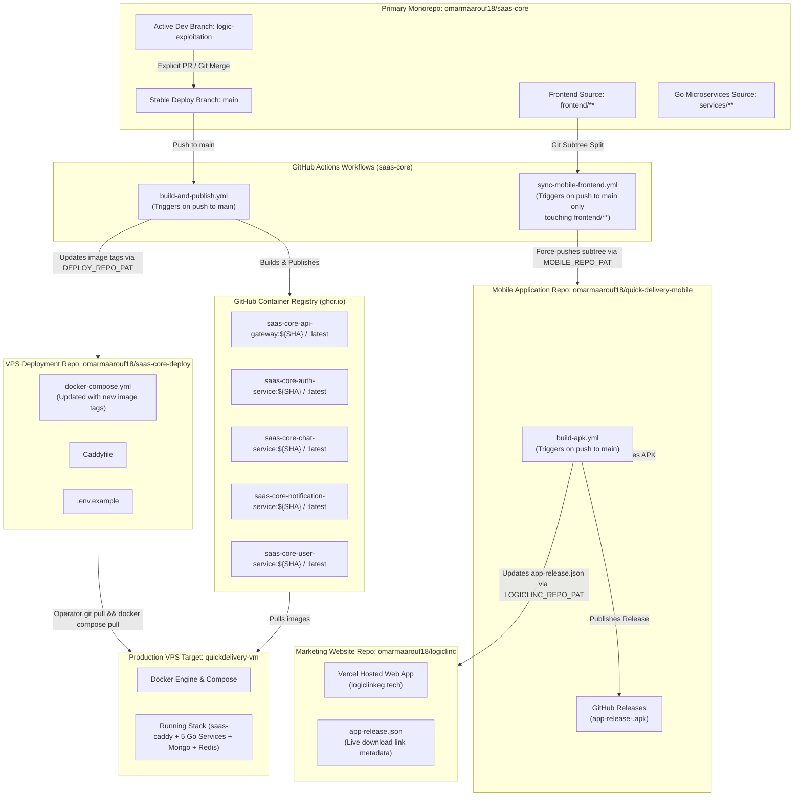

# Quick Delivery SaaS Platform — Four-Repo Ecosystem & Deployment Map

> [!NOTE]
> **Documentation Freshness Pinning**:
> This document maps the architecture, cross-repository push pipelines, PAT secret scopes, and operational runbooks for the Quick Delivery multi-repository ecosystem as of Git commit `8f9aa91`. This document must be updated whenever GitHub Action workflow triggers, repository structures, or secret scopes are modified.

---

## 1. Architectural Flowchart & Pipeline Triggers

The Quick Delivery platform operates across 4 decoupled GitHub repositories and 1 production cloud Virtual Private Server (VPS target `quickdelivery-vm`). Monorepo source code (`omarmaarouf18/saas-core`) is strictly isolated from production deployment manifests, standalone mobile app builds, and static marketing website release metadata.

> [!NOTE]
> **Planned Future Client App (Not Yet Created)**: Per [ADR-0013](adr/0013-support-agent-console-as-separate-client-application.md), a standalone Support Agent Console repository (`omarmaarouf18/support-agent-console`) is planned for administrative ticket resolution endpoints (`POST /chat/tickets/resolve`). This repository **does not exist yet** and is strictly out of scope for `frontend/` (`quick-delivery-mobile`).



---

## 2. GitHub Actions Secret & Security Matrix

The cross-repository push pipelines rely on GitHub App `quick-delivery-automation` installation tokens generated via `actions/create-github-app-token@v1`. Each secret (`APP_ID` and `APP_PRIVATE_KEY`) is stored in the initiating repository's **Settings -> Secrets and variables -> Actions** panel and operates under least-privilege scoping rules (refer to [ADR-0010](file:///mnt/windows_data/CS%20tools/Antigravity/SaaS%20prototype/docs/adr/0010-separate-repos-for-deployment-artifacts.md)):

| Secret Name | Stored In | Consuming Workflows | Target Repository | Scopes / Permissions | Status |
| :--- | :--- | :--- | :--- | :--- | :--- |
| **`APP_ID`** | `omarmaarouf18/saas-core`<br>`omarmaarouf18/quick-delivery-mobile` | `build-and-publish`, `sync-mobile-frontend`, `build-apk` | All target repos | Mint installation tokens | **Active** |
| **`APP_PRIVATE_KEY`** | `omarmaarouf18/saas-core`<br>`omarmaarouf18/quick-delivery-mobile` | `build-and-publish`, `sync-mobile-frontend`, `build-apk` | All target repos | RSA signing key | **Active** |
| **`DEPLOY_REPO_PAT`** | `omarmaarouf18/saas-core` | None | `saas-core-deploy` | `Contents: Read and write` | **Decommissioned & Revoked** |
| **`MOBILE_REPO_PAT`** | `omarmaarouf18/saas-core` | None | `quick-delivery-mobile` | `Contents: Read and write`, `Workflows: Read and write` | **Decommissioned & Revoked** |
| **`LOGICLINC_REPO_PAT`** | `omarmaarouf18/quick-delivery-mobile` | None | `logiclinc` | `Contents: Read and write` | **Decommissioned & Revoked** |

---

## 3. Branch Strategy & Production Gate Warnings

The repository enforces a strict two-tier branch safety model:

1. **Active Development Branch (`logic-exploitation`)**:
   - All feature implementation, bug fixes, documentation, and local testing occur on `logic-exploitation`.
   - Pushes to `logic-exploitation` do NOT trigger any mobile sync or release automation. Only merging into `main` triggers `sync-mobile-frontend.yml`. To manually test a sync from a feature branch, use `workflow_dispatch` explicitly (`gh workflow run sync-mobile-frontend.yml --ref logic-exploitation`) — this must be a deliberate manual action, never automatic.
   - > [!WARNING]
     > **No Automatic Production Deployment**: Commits pushed exclusively to `logic-exploitation` **NEVER** trigger Docker image builds or deployment tag updates in `saas-core-deploy`. Development work on `logic-exploitation` will not reach the production VPS (`quickdelivery-vm`) until explicitly merged into `main`.

2. **Production Deployment Branch (`main`)**:
   - `main` represents the stable, deployable state of the platform.
   - Pushing or merging changes into `main` automatically triggers `build-and-publish.yml` in GitHub Actions, which builds production multi-stage Docker images (`ghcr.io`), publishes them with the commit SHA tag, and updates `saas-core-deploy/docker-compose.yml`.

---

## 4. Day-to-Day Operator Runbook & Verification Commands

### 4.1 Merging `logic-exploitation` to `main` (Promoting a Release)
To trigger a production build and update `saas-core-deploy`:
```bash
git checkout main
git pull origin main
git merge logic-exploitation
git push origin main
git checkout logic-exploitation
```

### 4.2 Production VM Stack Deployment (`quickdelivery-vm`)
Deployment is **automated** via the self-hosted GitHub Actions runner (`saas-vm-runner`) on `quickdelivery-vm`. When `saas-core` pushes to `main`, `build-and-publish.yml` updates `saas-core-deploy:main`, triggering `deploy.yml` on the production VM. Per [ADR-0015](adr/0015-strict-cd-preflight-validation.md), the pipeline executes strict pre-flight environment checks (`--check-env`), full structural file synchronization (`rsync -a`), `docker compose pull`, `docker compose up -d --remove-orphans`, health checks across all services, and automated health-gated rollback on failure.

#### Manual Fallback (if runner is offline or undergoing maintenance)
```bash
ssh deploybot@quickdelivery-vm
cd /home/deploybot/actions-runner/_work/saas-core-deploy/saas-core-deploy
git pull origin main
docker compose pull
docker compose up -d --remove-orphans
```

*Note: For internal mTLS certificate regeneration, ensure `openssl x509 -req` includes `-copy_extensions copy` to preserve Subject Alternative Name (SAN) extensions (see [DEPLOYMENT.md §5.3](file:///mnt/windows_data/CS%20tools/Antigravity/SaaS%20prototype/docs/DEPLOYMENT.md#53-generate-internal-mtls-certificates)).*

### 4.3 Verifying Currently Deployed Image & Commit SHA
To inspect the exact container image tag active on the server:
```bash
docker inspect saas-api-gateway --format '{{.Config.Image}}'
```
Expected output: `ghcr.io/omarmaarouf18/saas-core-api-gateway:<40-char-sha>`

### 4.4 Incident Triage Matrix

| Failure Symptom | Primary Inspection Surface | Diagnostic Step / Command | Resolution Path |
| :--- | :--- | :--- | :--- |
| **OTP Emails / SMS Not Arriving** | `auth-service` Container Logs | `docker compose logs -f auth-service` | Verify `RESEND_API_KEY` and `RESEND_FROM_EMAIL` are configured in `.env`. Confirm Resend API domain status is verified. |
| **Public Domain Not Resolving / HTTP 502 / Connection Refused** | `saas-caddy` Container Status & Logs | `docker compose ps caddy` <br> `docker compose logs -f caddy` | Ensure `saas-caddy` container is running (see [DEPLOYMENT.md §10.5](file:///mnt/windows_data/CS%20tools/Antigravity/SaaS%20prototype/docs/DEPLOYMENT.md#105-missing-or-orphaned-saas-caddy-container-causing-public-domain-outage)). Confirm `Caddyfile` reverse_proxy target is `api-gateway:8080` over `saas-net`. |
| **Production Containers Not Updating After Push** | GitHub Actions `build-and-publish.yml` Log & `saas-core-deploy` Commits | Check [GitHub Actions Runs](https://github.com/omarmaarouf18/saas-core/actions) and [saas-core-deploy Commits](https://github.com/omarmaarouf18/saas-core-deploy/commits/main) | Verify push occurred to `main` (not `logic-exploitation` alone). Ensure GitHub App credentials (`APP_ID` and `APP_PRIVATE_KEY`) are valid. Run `docker compose pull` on the host. |

---

## 5. Monorepo Shared Dependency Constraint (`shared/infra` — Finding #9)

The shared infrastructure utilities (`shared/infra`, containing `jwtutil`, `handlerutil`, `resilience`, `tlsutil`, etc.) are linked via local relative paths across all microservice Go modules:
```go
replace github.com/project/shared/infra => ../../shared/infra
```

### 5.1 Accepted Architecture & Extraction Guidance
- **Relative Path Resolution**: `shared/infra` is resolved strictly via relative filesystem paths within this monorepo.
- **Service Extraction Rule**: If any microservice is ever copied or extracted into a separate application repository, `shared/infra` **must be copied alongside it** under the relative path expected by `go.mod`. There is currently no versioned or published module distribution mechanism (such as a standalone Git repository or private Go module proxy).

### 5.2 Known Maintenance Risk & Mitigation
- > [!WARNING]
  > **No Automated Security/Fix Propagation Across External Applications**: Any future bug fix, performance optimization, or security hardening applied to `shared/infra` within `saas-core` (e.g. security fixes to `jwtutil`, rate limiters, or TLS helpers) will **NOT** automatically propagate to any copied instance in external repositories.
  > Whoever maintains an extracted service in a separate application is solely responsible for manually re-syncing `shared/infra`. No automated tooling exists to detect or alert on code drift across standalone copies.

### 5.3 Long-Term Modularization Trigger
- **Accepted Tradeoff**: This relative-path monorepo coupling is a deliberate, accepted architectural tradeoff for the current single-monorepo deployment model.
- **Future Re-evaluation Trigger**: Publishing `shared/infra` as a standalone, versioned Go module (in its own dedicated repository or via a private module registry) remains the correct long-term fix. This transition should be formally revisited if/when 3 or more independent applications depend on extracted instances of `shared/infra`.
