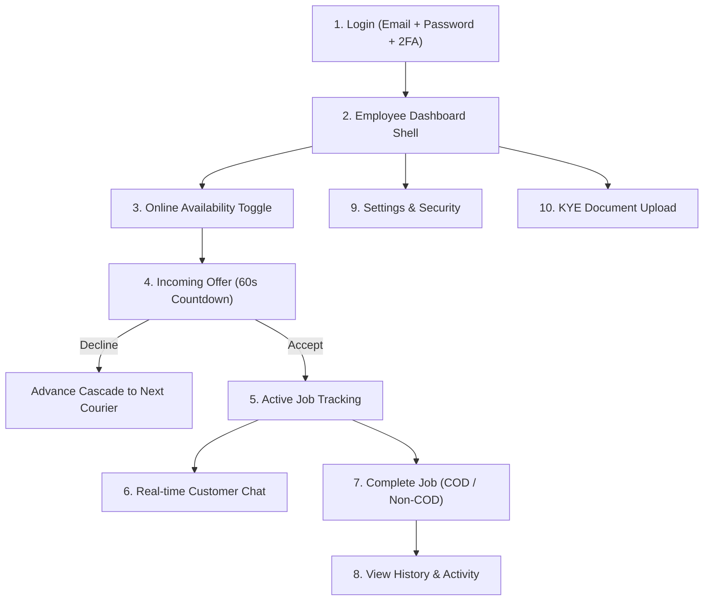

# Employee Role Comprehensive Functionality & UI/UX Audit

**Document Status:** Complete  
**Date:** 2026-09-19  
**Auditor:** Antigravity Engineering (Pair Programming Audit)  
**Scope:** Full courier/employee journey across `employee_home_screen.dart`, `employee_jobs_screen.dart`, `employee_history_screen.dart`, `employee_screen.dart`, and associated providers (`employee_jobs_provider.dart`, `employee_location_provider.dart`, `auth_provider.dart`).

---

## 1. Executive Summary

This audit evaluates the end-to-end functionality, backend API parity, error handling, state management, and teardown lifecycles of all screens and providers dedicated to the `employee` (courier) role.

Overall, the core operational dispatch workflow—receiving cascading dispatch offers, accepting/declining offers, real-time GPS tracking during active deliveries, customer chat, and job completion—is architecturally robust with solid backend parity. However, the audit uncovered **two high-severity lifecycle/teardown defects** (GPS heartbeat leak on logout, and availability ping cessation post-job-completion), **one critical UI affordance omission** (courier rating flow is implemented in `RatingScreen` but completely unreachable from employee screens), and **one monetary display bug** (COD job completion modal displays \$0.00 collection requirement).

---

## 2. Complete Courier Journey Analysis



### Step 1: Authentication & Role Landing
- **Files:** `frontend/lib/screens/login_screen.dart`, `frontend/lib/providers/auth_provider.dart`, `services/auth-service/internal/handlers/auth.go`.
- **Backend Endpoints:** `POST /auth/login`, `POST /auth/verify-otp`, `GET /auth/user`.
- **Functionality:** 
  - Employee logs in with email and password.
  - If 2FA is enabled, triggers OTP challenge via email.
  - **State-Sync Verification:** Both `POST /auth/login` (fast path and employee path) and `POST /auth/verify-otp` return `"role": "employee"` and `"two_factor_enabled": bool`. `AuthProvider._handleAuthSuccess` sets `_user.twoFactorEnabled` correctly.
  - On role match `user.role == 'employee'`, client routes directly to `EmployeeHomeScreen`.
- **Status:** **Working (Y)**.

### Step 2: Dashboard Navigation Shell
- **Files:** `frontend/lib/screens/employee_home_screen.dart`, `frontend/lib/widgets/dashboard_screen_template.dart`.
- **Functionality:**
  - Standardized M3 bottom navigation with 3 tabs:
    - Tab 0: **Assigned Jobs / Offers** (`EmployeeJobsScreen`)
    - Tab 1: **Job History** (`EmployeeHistoryScreen`)
    - Tab 2: **Settings** (`SettingsScreen`)
  - Lazy-hydrates visited tabs into an `IndexedStack` to preserve view state while switching tabs.
  - Top App Bar includes KYE Verification shortcut button (`key: Key('employee_verification_button')`) and Notification Bell with real-time unread badge.
  - Subscribes to `NotificationsProvider`: upon receiving a notification of type `job_alert`, it triggers `_refreshData()` to reload assigned jobs immediately.
- **Status:** **Working (Y)**.

### Step 3: Courier Availability & Live GPS Dispatch Pings
- **Files:** `frontend/lib/screens/employee_jobs_screen.dart`, `frontend/lib/providers/employee_location_provider.dart`.
- **Backend Endpoint:** `POST /users/employee/location` (`requester_token`, `latitude`, `longitude`).
- **Functionality:**
  - Courier toggles online/offline availability via `Switch.adaptive` (`key: Key('courier_availability_switch')`). State persists locally in `FlutterSecureStorage` (`courier_available_online`).
  - When online: launches `GeolocatorPlatform.instance.getPositionStream` (10m distance filter, 3.5s minimum interval gate) and a 60-second periodic heartbeat timer (`_startAvailabilityHeartbeat`). Stationary couriers ping every 60 seconds; moving couriers ping on movement.
  - Switch is disabled during an active delivery (`onChanged: hasActiveJob ? null : ...`) to prevent going offline mid-delivery.
- **Identified Defects:**
  - **Post-Job Completion Teardown Bug:** When a job is completed via `_confirmAndCompleteJob()`, the screen calls `locationProvider.stopTracking()`. However, if `locationProvider.isAvailableOnline` is still `true`, it **never calls `startAvailabilityTracking(auth.token)`**. As a result, the courier stops sending availability pings entirely while the UI switch remains in the "Online" position. After 5 minutes, backend location becomes stale (`> EmployeeLocationFreshnessWindow`), causing subsequent dispatch offers to fail with HTTP 409 `location_stale`.
  - **Logout Teardown Leak:** When logging out via `AuthProvider.logout()` or `forceLogout()`, `EmployeeLocationProvider.stopTracking()` is never invoked. The background GPS stream and 60-second heartbeat timer continue firing in the background with an expired token.
- **Status:** **Broken / Partially Working (N)** (Teardown & re-activation leaks).

### Step 4: Incoming Dispatch Offers & Cascade Expiry
- **Files:** `frontend/lib/screens/employee_jobs_screen.dart`, `frontend/lib/providers/employee_jobs_provider.dart`.
- **Backend Endpoints:** `GET /users/jobs/get?requester_id=...`, `POST /users/employee/jobs/:id/accept`, `POST /users/employee/jobs/:id/decline`.
- **Functionality:**
  - Offers (`status == 'pending_dispatch'`) render at the top of the job list in `_buildIncomingOfferCard()`.
  - A 1-second periodic timer (`_countdownTimer`) calculates `job.offerExpiresAt.difference(DateTime.now()).inSeconds` and renders a live countdown badge.
  - Tapping "Decline" (`POST /users/employee/jobs/:id/decline`) atomically removes the offer and advances the dispatch cascade to the next candidate courier on backend.
  - Tapping "Accept" (`POST /users/employee/jobs/:id/accept`) claims the job via CAS, locks the courier, updates the status to `active`, and switches `EmployeeLocationProvider` to job-tracking mode.
- **Identified Gaps:**
  - **Stuck Expired Card:** When `remainingSecs <= 0`, the card updates its badge to "UNAVAILABLE" and disables buttons, but it does **not automatically evict itself or trigger a re-poll**. The expired offer sits on screen until the courier manually pulls to refresh or receives an SSE notification.
  - **Price / Earnings Blindness:** The offer card shows route coordinates and payment method, but does **not display the suggested price, agreed price, or expected courier payout**.
- **Status:** **Partially Working (P)** (Accept/decline cascade works; countdown transition is passive; price info missing).

### Step 5: Active Job Execution & Live Route Tracking
- **Files:** `frontend/lib/screens/employee_jobs_screen.dart`, `frontend/lib/providers/employee_location_provider.dart`.
- **Backend Endpoint:** `POST /users/jobs/location/update` (`job_id`, `requester_id`, `latitude`, `longitude`).
- **Functionality:**
  - Automatically switches GPS stream to track active delivery (`startTracking(activeJob.id)`).
  - Pings location updates with high accuracy, subject to client-side 3.5s throttle gate.
  - Displays prominent green live GPS status badge ("Sharing live location with customer") and header GPS status pill.
  - Non-fatal responses (HTTP 429 rate limit or HTTP 400 `implausible_speed`) are logged quietly without resetting tracking status or disrupting delivery.
- **Status:** **Working (Y)**.

### Step 6: Real-time Customer Messaging
- **Files:** `frontend/lib/screens/chat_screen.dart`, `frontend/lib/providers/chat_provider.dart`.
- **Backend Endpoints:** `GET /chat/ws?token=...&job_id=...`, `GET /chat/history?job_id=...`.
- **Functionality:**
  - Both incoming offer cards and active job cards provide a direct "Chat with Customer" button.
  - Opens `ChatScreen(jobId: job.id)` with full real-time WebSocket messaging, auto-scroll, message status indicators, and localized input field.
  - WebSocket connection properly disconnects in `ChatScreen.dispose()`.
- **Status:** **Working (Y)**.

### Step 7: Job Completion & Settlement
- **Files:** `frontend/lib/screens/employee_jobs_screen.dart`, `frontend/lib/providers/employee_jobs_provider.dart`, `services/user-service/internal/handlers/jobs_handlers.go`.
- **Backend Endpoint:** `POST /users/jobs/complete` (`job_id`, `cash_collected`, `requester_id`).
- **Functionality:**
  - Courier taps "Complete Job", opening `ConfirmActionDialog`.
  - Non-COD: Triggers ADR-0007 GPS trail distance verification (>70% booked distance); releases escrow to owner wallet; releases courier lock; marks status `completed`.
  - COD: Requires `cash_collected: true`. Logs cash collection, records 0% platform fee, releases courier lock.
- **Identified Defect:**
  - **COD Confirmation Modal Shows \$0.00 Collection:** In `_confirmAndCompleteJob()`, the dialog message uses:
    ```dart
    job.lockedEscrowAmount?.toStringAsFixed(2) ?? '0.00'
    ```
    For COD jobs, `lockedEscrowAmount` is `0.00` or `null` by definition (no escrow is locked from the customer's wallet). The confirmation modal prompts the courier: *"Confirm you have physically collected the cash payment of $0.00 (COD) from the customer"*. It should instead reference `job.agreedPrice ?? job.suggestedPrice` or `job.actualCashAmount`.
- **Status:** **Broken / Partially Working (N)** (Backend completes correctly, but UI dialog displays misleading \$0.00).

### Step 8: Job History & Earnings Record
- **Files:** `frontend/lib/screens/employee_history_screen.dart`, `frontend/lib/widgets/list_screen_template.dart`.
- **Backend Endpoint:** `GET /users/jobs/get?requester_id=...`.
- **Functionality:**
  - Filters assigned jobs where status is `completed` or `cancelled`.
  - Handles loading skeletons (`EmployeeJobCardSkeleton`), empty state (`ThemedEmptyState`), error banner (`ThemedErrorBanner`), and pull-to-refresh.
- **Identified Gaps:**
  - **No Courier Payout / Earnings Metric:** Displays `Escrow: $...` (the tenant's locked escrow). For COD jobs, no amount is shown at all because escrow is 0. Couriers have no summary card showing total daily/weekly earnings or completed deliveries count.
  - **Missing Pagination:** Fetches the full unpaginated list of assigned jobs.
- **Status:** **Partially Working (P)** (Renders history accurately, but lacks courier-specific financial metrics).

### Step 9: Rating & Feedback Flow
- **Files:** `frontend/lib/screens/rating_screen.dart`, `frontend/lib/providers/marketplace_provider.dart`.
- **Backend Endpoints:** `POST /users/reviews`, `GET /users/reviews`.
- **Functionality:**
  - `RatingScreen` contains explicit role support for couriers:
    ```dart
    if (user.role == 'employee') {
      _otherPartyId = widget.job.userId;
      _otherPartyName = l10n.proposalRoleCustomer;
      _otherPartyRole = l10n.signupRoleCustomer;
    }
    ```
  - `rateJob` submits 1-5 stars and feedback comments against `targetUserId: job.userId`.
- **Identified Gap:**
  - **Completely Unreachable from Employee UI:** `RatingScreen` is ONLY instantiated in `job_status_screen.dart:1207` (a customer-only screen). There is **no button or action anywhere in `EmployeeJobsScreen` or `EmployeeHistoryScreen`** allowing an employee to rate a customer after delivery.
  - **No Visibility of Received Ratings:** An employee cannot view their courier rating, star average, or customer feedback anywhere in the app.
- **Status:** **Broken / Unreachable (N)**.

### Step 10: Role Boundaries (`employee_screen.dart`)
- **Files:** `frontend/lib/screens/employee_screen.dart`.
- **Functionality:**
  - `EmployeeScreen` is primarily an **Owner-facing** worker management dashboard ("Manage Workers" & "Audit Trail").
  - Role Boundary Guard:
    ```dart
    final auth = Provider.of<AuthProvider>(context);
    if (auth.user?.role == 'employee') {
      return const EmployeeJobsScreen();
    }
    ```
    If an employee navigates to `EmployeeScreen`, it immediately redirects and renders `EmployeeJobsScreen`.
- **Status:** **Working (Y)** (Clean role boundary).

---

## 3. Comprehensive Findings Table

| Screen | Function | Working (Y/N/P) | Evidence / File Reference | Severity |
|---|---|---|---|---|
| `EmployeeHomeScreen` | Bottom Tab Navigation | **Y** | `employee_home_screen.dart:176-188` (IndexedStack preserves state) | None |
| `EmployeeHomeScreen` | Notification Event Dispatch | **Y** | `employee_home_screen.dart:50-56` (re-fetches jobs on `job_alert`) | None |
| `EmployeeJobsScreen` | Availability Switch Toggle | **Y** | `employee_jobs_screen.dart:523-535` (`courier_availability_switch`) | None |
| `EmployeeJobsScreen` | Availability GPS Heartbeat | **Y** | `employee_location_provider.dart:225-253` (60s timer + 10m stream) | None |
| `EmployeeJobsScreen` | Availability Post-Completion Reconnect | **N** | `employee_jobs_screen.dart:183-184` calls `stopTracking()` on complete, never re-activates availability tracking despite `isAvailableOnline == true` | **High** |
| `EmployeeJobsScreen` | Incoming Offer Countdown | **Y** | `employee_jobs_screen.dart:62-72` (1-sec periodic timer ticks countdown) | None |
| `EmployeeJobsScreen` | Expired Offer Auto-Eviction | **N** | `employee_jobs_screen.dart:756-765` (stays on screen with UNAVAILABLE badge; no auto-discard or re-poll) | **Medium** |
| `EmployeeJobsScreen` | Accept Dispatch Offer | **Y** | `employee_jobs_screen.dart:914-919` (`POST /users/employee/jobs/:id/accept`) | None |
| `EmployeeJobsScreen` | Decline Dispatch Offer | **Y** | `employee_jobs_screen.dart:921-926` (`POST /users/employee/jobs/:id/decline`) | None |
| `EmployeeJobsScreen` | Active Job Location Streaming | **Y** | `employee_location_provider.dart:255-287` (`POST /users/jobs/location/update`) | None |
| `EmployeeJobsScreen` | Customer Chat Launcher | **Y** | `employee_jobs_screen.dart:1144-1157` (`ChatScreen(jobId: job.id)`) | None |
| `EmployeeJobsScreen` | Non-COD Job Completion | **Y** | `employee_jobs_screen.dart:180` (`POST /users/jobs/complete`) | None |
| `EmployeeJobsScreen` | COD Confirmation Amount | **N** | `employee_jobs_screen.dart:151-153` passes `job.lockedEscrowAmount` (which is \$0.00 for COD) instead of `agreedPrice` or `suggestedPrice` | **Medium** |
| `EmployeeJobsScreen` | Price Proposal Negotiation | **N** | No UI for couriers to view proposed prices or respond to customer proposals; only customer sees `JobStatusScreen` proposal UI | **Low** |
| `EmployeeJobsScreen` | Action Simulator Submission | **Y** | `employee_jobs_screen.dart:109-138` (`POST /auth/employee/action`) | None |
| `EmployeeHistoryScreen` | Completed / Cancelled Roster | **Y** | `employee_history_screen.dart:49-53` (filters completed/cancelled) | None |
| `EmployeeHistoryScreen` | Loading / Error / Empty States | **Y** | `employee_history_screen.dart:79-111` (Skeleton, ErrorBanner, EmptyState) | None |
| `EmployeeHistoryScreen` | Courier Earnings Breakdown | **N** | Displays owner escrow amount; no courier commission, daily earnings, or payout metrics | **Low** |
| `EmployeeHistoryScreen` | History Pagination | **P** | Unpaginated list; suitable for moderate activity but lacks infinite scroll | **Low** |
| `RatingScreen` | Courier Rating Customer | **N** | Business logic exists in `rating_screen.dart:63-67`, but **zero buttons exist on employee screens** to launch it | **High** |
| `RatingScreen` | View Received Courier Ratings | **N** | No UI or endpoint call in employee screens to display courier's average rating or review history | **Medium** |
| `AuthProvider` | Logout Location Stream Teardown | **N** | `auth_provider.dart:389-425` (`logout()` / `forceLogout()`) does not stop `EmployeeLocationProvider`, leaving GPS stream & heartbeat timer running | **High** |
| `EmployeeScreen` | Owner vs Employee Role Boundary | **Y** | `employee_screen.dart:110` redirects `role == 'employee'` to `EmployeeJobsScreen` | None |

---

## 4. Prioritized Recommendations for Future Hardening

1. **Re-activate Availability Tracking Post-Completion (High Priority):**
   In `employee_jobs_screen.dart:_confirmAndCompleteJob`, after calling `locationProvider.stopTracking()`, check `if (locationProvider.isAvailableOnline) await locationProvider.startAvailabilityTracking(auth.token!)`.
2. **Teardown Location Tracking on Logout (High Priority):**
   In `auth_provider.dart:logout` and `forceLogout`, add a teardown hook or dispose callback that invokes `EmployeeLocationProvider.stopTracking()`.
3. **Expose Customer Rating Action in Employee History (High Priority):**
   Add a "Rate Customer" button on completed job cards in `EmployeeHistoryScreen` and/or immediately following job completion in `EmployeeJobsScreen` navigating to `RatingScreen(job: job)`.
4. **Fix COD Confirmation Dialog Copy (Medium Priority):**
   In `employee_jobs_screen.dart:151`, change `job.lockedEscrowAmount` to `(job.agreedPrice ?? job.suggestedPrice ?? 0.0)`.
5. **Auto-Evict Expired Dispatch Offers (Medium Priority):**
   In `employee_jobs_screen.dart:_countdownTimer`, when an offer transitions to `remainingSecs <= 0`, trigger an automatic silent `_refreshJobs()` to cleanly evict the expired offer from the roster.
