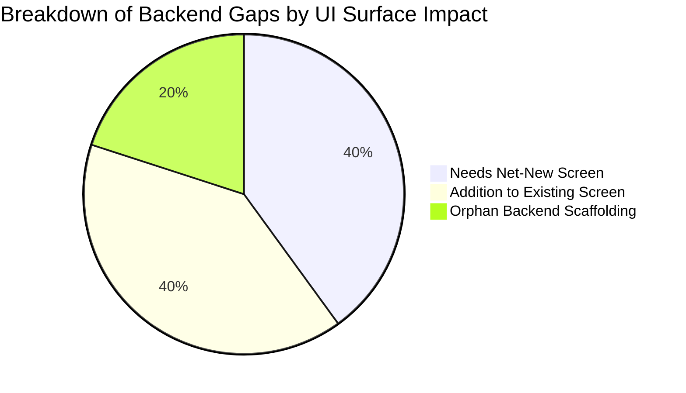

# Backend Capabilities & Messaging Backlog

> [!NOTE]
> **Audit Purpose**: Comprehensive ground-truth audit of all 5 backend Go microservices (`api-gateway`, `auth-service`, `user-service`, `chat-service`, `notification-service`) cross-referenced against the Flutter mobile app (`frontend/`) and the standalone Operations Console (`omarmaarouf18/kyc-reviewer-console`).
> This document tracks backend capabilities that are implemented and functional at the service layer but lack consumer UI or complete integration in the mobile app.

---

## 1. Ground-Truth Route Inventory

The table below catalogs every registered HTTP endpoint across all 5 backend microservices, classifying its intended consumer and confirming the exact caller reference in the codebase.

### Classification Key:
- **Mobile App**: Consumer, Owner, or Courier role workflows in `frontend/lib/`.
- **Ops Console**: Administrative reviewer workflows in `kyc-reviewer-console` (ADR-0021 / ADR-0022 / ADR-0023).
- **Internal**: Service-to-service communication requiring `X-Internal-Token` or internal mTLS (no external UI caller).
- **Infra**: Health probes, circuit breaker diagnostics, or load balancer endpoints.

| Service | HTTP Route & Normalized Path | Handler Function | Intended Consumer | Mobile App Reference (`frontend/`) | Ops Console Reference (`kyc-reviewer-console`) |
| :--- | :--- | :--- | :--- | :--- | :--- |
| **`api-gateway`** | `GET /health` | `main.go:73` (inline) | Infra | N/A (Load Balancer / Probe) | N/A |
| `api-gateway` | `GET /health/internal` | `main.go:80` (inline) | Infra / SRE | N/A (`X-Internal-Token` Prometheus) | N/A |
| `api-gateway` | `GET\|PUT /api/v1/admin/version-config` | `main.go:94` (inline) | Ops Admin / SRE | N/A (Gating consumed via middleware) | N/A |
| `api-gateway` | `GET /` | `main.go:131` (inline) | Infra | N/A (Root Gateway Info) | N/A |
| **`auth-service`** | `POST /auth/signup` | `a.Signup` | Mobile App | `lib/providers/auth_provider.dart:140` `lib/providers/owner_provider.dart:109` | N/A |
| `auth-service` | `POST /auth/login` | `a.Login` | Mobile App | `lib/providers/auth_provider.dart:163` | N/A |
| `auth-service` | `POST /auth/resend-otp` | `a.ResendOTP` | Mobile App | `lib/providers/auth_provider.dart:232` | N/A |
| `auth-service` | `POST /auth/verify-otp` | `a.VerifyOTP` | Mobile App | `lib/providers/auth_provider.dart:195` | N/A |
| `auth-service` | `POST /auth/forgot-password` | `a.ForgotPassword` | Mobile App | `lib/providers/auth_provider.dart:253` | N/A |
| `auth-service` | `POST /auth/reset-password` | `a.ResetPassword` | Mobile App | `lib/providers/auth_provider.dart:275` | N/A |
| `auth-service` | `POST /auth/refresh` | `a.Refresh` | Mobile App | `lib/core/api_client.dart:435` | N/A |
| `auth-service` | `POST /auth/employee/toggle` | `a.ToggleEmployee` | Mobile App | `lib/providers/owner_provider.dart:143` | N/A |
| `auth-service` | `POST /auth/employee/action` | `a.SimulateEmployeeAction` | Mobile App | `lib/providers/employee_jobs_provider.dart:61` | N/A |
| `auth-service` | `GET /auth/audit-log` | `a.GetAuditLog` | Mobile App | `lib/providers/owner_provider.dart:206` | N/A |
| `auth-service` | `GET /auth/employees` | `a.GetEmployees` | Mobile App | `lib/providers/owner_provider.dart:171` | N/A |
| `auth-service` | `GET /auth/user` | `a.GetUser` | Mobile App / Internal | `lib/providers/auth_provider.dart:79` | N/A |
| `auth-service` | `PATCH /auth/user` | `a.UpdateUser` | Mobile App | `lib/providers/auth_provider.dart:432` | N/A |
| `auth-service` | `GET /auth/user/public-profile` | `a.GetPublicProfile` | Mobile App | `lib/screens/job_status_screen.dart:260` | N/A |
| `auth-service` | `POST /auth/kyb/upload` | `a.UploadKYB` | Mobile App | `lib/providers/auth_provider.dart:111` | N/A |
| `auth-service` | `POST /auth/kye/upload` | `a.UploadKYE` | Mobile App | `lib/providers/auth_provider.dart:112` | N/A |
| `auth-service` | `GET /auth/kyb-kye/pending` | `a.GetPendingKYBKYESubmissions` | Ops Console | None (Excluded per ADR-0013) | `internal/proxy/proxy.go:130` |
| `auth-service` | `POST /auth/kyb-kye/review` | `a.ReviewKYBKYESubmissions` | Ops Console | None (Excluded per ADR-0013) | `internal/proxy/proxy.go:180` |
| `auth-service` | `GET /auth/documents/view` | `a.ViewDocument` | Ops Console | None (Excluded per ADR-0013) | `internal/proxy/proxy.go:199` |
| `auth-service` | `GET /auth/accounts` | `a.GetAccounts` | Ops Console | None (Excluded per ADR-0022) | `internal/proxy/proxy.go:208` |
| `auth-service` | `POST /auth/accounts/suspend` `POST /auth/accounts/{id}/suspend` | `a.SuspendAccount` | Ops Console | None (Excluded per ADR-0022) | `internal/proxy/proxy.go:252` |
| `auth-service` | `POST /auth/accounts/reactivate` `POST /auth/accounts/{id}/reactivate` | `a.ReactivateAccount` | Ops Console | None (Excluded per ADR-0022) | `internal/proxy/proxy.go:288` |
| `auth-service` | `GET /auth/reviewer/verify` | `a.VerifyReviewer` | Ops Console / Internal | None (Inter-service / Console) | `docs/ARCHITECTURE.md:24` |
| `auth-service` | `DELETE /auth/device-token` | `a.DeviceToken` | Mobile App | `lib/core/api_client.dart:497, 505` | N/A |
| `auth-service` | `POST /auth/email-change/request` | `a.RequestEmailChange` | Mobile App | `lib/providers/auth_provider.dart:298` | N/A |
| `auth-service` | `POST /auth/email-change/confirm` | `a.ConfirmEmailChange` | Mobile App | `lib/providers/auth_provider.dart:319` | N/A |
| `auth-service` | `POST /auth/logout` | `a.Logout` | Mobile App | `lib/providers/auth_provider.dart:388` | N/A |
| **`user-service`** | `GET /users/services` | `u.ListServices` | Mobile App | `lib/providers/marketplace_provider.dart:37` `lib/providers/owner_provider.dart:232` | N/A |
| `user-service` | `POST /users/services` | `u.CreateService` | Mobile App | `lib/providers/owner_provider.dart:260` | N/A |
| `user-service` | `PUT\|PATCH /users/services` `POST\|PUT\|PATCH /users/services/update` | `u.UpdateService` | Mobile App | `lib/providers/owner_provider.dart:322` | N/A |
| `user-service` | `POST /users/jobs/track` | `u.TrackJob` | Mobile App | `lib/providers/marketplace_provider.dart:77` | N/A |
| `user-service` | `GET /users/jobs/get` | `u.GetJob` | Mobile App / Internal | `lib/providers/employee_jobs_provider.dart:26` `lib/providers/map_tracking_provider.dart:118` `lib/providers/marketplace_provider.dart:106` | N/A |
| `user-service` | `GET /users/jobs/owner` | `u.GetOwnerJobs` | Mobile App | `lib/providers/map_tracking_provider.dart:63` `lib/providers/owner_provider.dart:377` | N/A |
| `user-service` | `GET /users/jobs/mine` | `u.GetCustomerJobs` | Mobile App | `lib/providers/marketplace_provider.dart:299` | N/A |
| `user-service` | `POST /users/jobs/complete` | `u.CompleteJob` | Mobile App | `lib/providers/employee_jobs_provider.dart:82` | N/A |
| `user-service` | `POST /users/jobs/cancel` | `u.CancelJob` | Mobile App | `lib/providers/marketplace_provider.dart:246` `lib/providers/owner_provider.dart:414` | N/A |
| `user-service` | `POST /users/jobs/propose-price` | `u.ProposePrice` | Mobile App | `lib/core/api_client.dart:471` | N/A |
| `user-service` | `POST /users/jobs/respond-price` | `u.RespondPrice` | Mobile App | `lib/core/api_client.dart:484` | N/A |
| `user-service` | `POST /users/employee/jobs/accept` `POST /users/employee/jobs/{id}/accept` | `u.AcceptJobOffer` | Mobile App | `lib/providers/employee_jobs_provider.dart:129` | N/A |
| `user-service` | `POST /users/employee/jobs/decline` `POST /users/employee/jobs/{id}/decline` | `u.DeclineJobOffer` | Mobile App | `lib/providers/employee_jobs_provider.dart:188` | N/A |
| `user-service` | `GET /users/wallet` | `u.GetWallet` | Mobile App | `lib/providers/owner_provider.dart:44` | N/A |
| `user-service` | `POST /users/wallet/deposit` | `u.WalletDeposit` | Mobile App | `lib/providers/owner_provider.dart:74` | N/A |
| `user-service` | `POST /users/wallet/payout/request` | `u.RequestPayout` | Mobile App | `lib/providers/owner_provider.dart:495` | N/A |
| `user-service` | `GET /users/wallet/payout/requests` | `u.GetPayoutRequests` | Mobile App | `lib/providers/owner_provider.dart:524` | N/A |
| `user-service` | `GET /users/ledger` | `u.GetLedger` | Mobile App | `lib/providers/owner_provider.dart:57` | N/A |
| `user-service` | `GET /users/platform/config` | `u.GetPlatformConfig` | Mobile App | `lib/providers/owner_provider.dart:468` | N/A |
| `user-service` | `GET\|POST /users/subscription` | `u.Subscription` | Mobile App | `lib/providers/owner_provider.dart:52, 347` | N/A |
| `user-service` | `POST /users/jobs/rate` | `u.RateJob` | Mobile App | `lib/providers/marketplace_provider.dart:136` | N/A |
| `user-service` | `GET /users/ratings` | `u.GetRatings` | Mobile App | `lib/providers/marketplace_provider.dart:156` | N/A |
| `user-service` | `POST /users/jobs/location/update` | `u.UpdateJobLocation` | Mobile App | `lib/providers/employee_location_provider.dart:159` | N/A |
| `user-service` | `POST /users/employee/location` | `u.UpdateEmployeeLocation` | Mobile App | `lib/providers/employee_location_provider.dart:193` | N/A |
| `user-service` | `GET /users/jobs/reconciliation-queue` | `u.GetReconciliationQueue` | Mobile App | `lib/providers/reconciliation_provider.dart:25` | N/A |
| `user-service` | `POST /users/jobs/reconciliation-resolve` | `u.ResolveReconciliation` | Mobile App | `lib/providers/reconciliation_provider.dart:51` | N/A |
| `user-service` | `GET /admin/reconciliation/queue` `GET /users/admin/reconciliation/queue` | `u.AdminGetReconciliationQueue` | Ops Console | None (Excluded per ADR-0023) | `internal/proxy/proxy.go:297` |
| `user-service` | `POST /admin/reconciliation/resolve` `POST /users/admin/reconciliation/resolve` | `u.AdminResolveReconciliation` | Ops Console | None (Excluded per ADR-0023) | `internal/proxy/proxy.go:346` |
| `user-service` | `GET /admin/subscriptions` `GET /admin/subscriptions/queue` `GET /users/admin/subscriptions` | `u.AdminListSubscriptions` | Ops Console | None (Excluded per ADR-0023) | `internal/proxy/proxy.go:355` |
| `user-service` | `POST /admin/subscriptions/activate` `POST /users/admin/subscriptions/activate` | `u.AdminActivateSubscription` | Ops Console | None (Excluded per ADR-0023) | `internal/proxy/proxy.go:392` |
| `user-service` | `POST /admin/subscriptions/revoke` `POST /users/admin/subscriptions/revoke` | `u.AdminRevokeSubscription` | Ops Console | None (Excluded per ADR-0023) | `internal/proxy/proxy.go:433` |
| **`chat-service`** | `GET /chat/ws` | `c.HandleWebSocket` | Mobile App | `lib/providers/chat_provider.dart:96` `lib/providers/map_tracking_provider.dart:199` | N/A |
| `chat-service` | `GET /chat/history` | `c.GetHistory` | Mobile App | `lib/providers/chat_provider.dart:52` | N/A |
| `chat-service` | `POST /chat/internal/broadcast-location` | `c.BroadcastLocation` | Internal | None (Called by `user-service`) | N/A |
| `chat-service` | `POST /chat/tickets` | `c.HandleCreateTicket` | Mobile App | `lib/providers/chat_provider.dart:222` | N/A |
| `chat-service` | `GET /chat/tickets/mine` `GET /tickets/mine` | `c.GetCustomerTickets` | Mobile App | `lib/core/api_client.dart:457` `lib/providers/chat_provider.dart:253` | N/A |
| `chat-service` | `POST /chat/tickets/resolve` | `c.HandleResolveTicket` | Legacy Agent | None (Orphan agent-token endpoint) | None |
| `chat-service` | `GET /admin/tickets` `GET /chat/admin/tickets` | `c.AdminListTickets` | Ops Console | None (Excluded per ADR-0023) | `internal/proxy/proxy.go:442` |
| `chat-service` | `POST /admin/tickets/resolve` `POST /chat/admin/tickets/resolve` | `c.AdminResolveTicket` | Ops Console | None (Excluded per ADR-0023) | `internal/proxy/proxy.go:486` |
| **`notification-service`** | `GET /notifications/stream` | `n.Stream` | Mobile App | `lib/providers/notifications_provider.dart:73` | N/A |
| `notification-service` | `POST /notifications/send` | `n.Send` | Internal | None (Called by auth/user/chat) | N/A |
| `notification-service` | `POST /notifications/broadcast/job-alert` | `n.BroadcastJobAlert` | Internal | None (Called by `user-service`) | N/A |
| `notification-service` | `GET /notifications/history` | `n.History` | Mobile App | `lib/providers/notifications_provider.dart:169, 218` | N/A |
| `notification-service` | `POST /notifications/read-all` | `n.ReadAll` | Mobile App | `lib/providers/notifications_provider.dart:286` | N/A |
| `notification-service` | `POST /notifications/{id}/read` | `n.MarkRead` | Mobile App | `lib/providers/notifications_provider.dart:262` | N/A |
| `notification-service` | `DELETE /notifications/{id}` | `n.Delete` | Mobile App | `lib/providers/notifications_provider.dart:305` | N/A |
| `notification-service` | `DELETE /notifications` | `n.DeleteAll` | Mobile App | `lib/providers/notifications_provider.dart:324` | N/A |

---

## 2. Deep-Dive: Unconsumed Mobile-App Capabilities & Scaffolding

After filtering out internal service-to-service endpoints and ops-console endpoints (per ADR-0013, ADR-0021, ADR-0022, ADR-0023), the audit identified **5 concrete capability gaps** where backend functionality is ahead of the Flutter frontend.

---

### GAP-01: Support Ticket Chat Thread (`ticket:<ticketID>` Channel)

* **Severity / Priority**: **High (P1)** — **[RESOLVED & VERIFIED]**
* **Impact Classification**: **Needs Net-New Screen** (Resolved: `TicketChatScreen` implemented)
* **Related ADR**: [ADR-0013](../adr/0013-support-agent-console-as-separate-client-application.md), [ADR-0023](../adr/0023-modular-ops-console-expansion.md)

#### Detailed Finding & Implementation
- **Backend Capability**:
  - `services/chat-service/internal/handlers/chat.go:183`: `canAccessChannel` explicitly authorizes channel `ticket:<ticketID>` for `ticket.CustomerID` and `ticket.AssignedAgentID`.
  - `services/chat-service/internal/store/mongodb.go:141`: `PersistMessage` records chat messages under arbitrary channels, including `ticket:<ticketID>`.
  - `services/chat-service/internal/handlers/admin_tickets.go:138`: `AdminResolveTicket` automatically inserts a system resolution chat message (`sender_id: "system:support"`, `type: "ticket_resolution"`) into `ticket:<ticketID>` and broadcasts it to active subscribers.
  - `services/chat-service/internal/handlers/chat.go:210`: `GET /chat/history?channel=ticket:<ticketID>` returns full historical messages for the ticket thread.
- **Frontend Implementation**:
  - Generalized `ChatProvider` (`frontend/lib/providers/chat_provider.dart`) to support generic channels (`_currentChannel`, `fetchChannelHistory`, `connectAndSubscribeChannel`, and `sendMessage` using `_currentChannel`).
  - Built `TicketChatScreen` (`frontend/lib/screens/ticket_chat_screen.dart`): lightweight conversation screen scoped to `ticket:<id>`, showing ticket metadata header, live messages, resolution banner with resolution note, input bar disabled on resolved tickets, and real-time transition on `ticket_resolution` incoming message.
  - Verified via dedicated widget tests in `frontend/test/customer_tickets_test.dart`.

---

### GAP-02: Customer Support Ticket History & Status List

* **Severity / Priority**: **High (P1)** — **[RESOLVED & VERIFIED]**
* **Impact Classification**: **Needs Net-New Screen** + **Backend Query Extension** (Resolved: `GET /chat/tickets/mine` & `CustomerTicketsScreen`)
* **Related ADR**: [ADR-0013](../adr/0013-support-agent-console-as-separate-client-application.md)

#### Detailed Finding & Implementation
- **Backend Capability & Implementation**:
  - Added `ListCustomerTickets` in `services/chat-service/internal/store/mongodb.go` returning tickets matching authenticated `customer_id`, sorted by `created_at: -1`, with pagination clamping.
  - Implemented `GetCustomerTickets` handler in `services/chat-service/internal/handlers/chat.go` registered under `GET /chat/tickets/mine` and `GET /tickets/mine` protected by user JWT authentication and rate limiting.
  - Verified via `TestGetCustomerTickets_IsolationAndPagination` in `services/chat-service/internal/handlers/chat_test.go` proving customer isolation (IDOR protection) and pagination clamping.
- **Frontend Implementation**:
  - Added `SupportTicket` model (`frontend/lib/models/support_ticket.dart`).
  - Added `getCustomerTickets` to `ApiClient` (`frontend/lib/core/api_client.dart`) and `fetchCustomerTickets` in `ChatProvider`.
  - Built `CustomerTicketsScreen` (`frontend/lib/screens/customer_tickets_screen.dart`) with filter pills (All, Open, Resolved), status badges, resolution note preview, empty state, pull-to-refresh, and FAB opening `CreateTicketDialog`.
  - Added "Support Tickets" entry point in `SettingsScreen` (`frontend/lib/screens/settings_screen.dart`).
  - Wired `ticket_resolved` notification routing in `NotificationsScreen` (`frontend/lib/screens/notifications_screen.dart`) to navigate directly to ticket view.
  - Verified via unit and widget tests in `frontend/test/customer_tickets_test.dart`.

---

### GAP-03: Orphan Agent-Token Support Resolution Endpoint (`POST /chat/tickets/resolve`)

* **Severity / Priority**: **Low (P3 - Technical Debt)**
* **Impact Classification**: **Orphan Backend Scaffolding**
* **Related ADR**: [ADR-0013](../adr/0013-support-agent-console-as-separate-client-application.md), [ADR-0023](../adr/0023-modular-ops-console-expansion.md)

#### Detailed Finding
- **Backend Capability**:
  - `services/chat-service/internal/handlers/chat.go:351`: `HandleResolveTicket` (`POST /chat/tickets/resolve`) accepts `X-Agent-Token` header.
  - `services/chat-service/cmd/onboard-agent`: Standalone CLI tool to generate agent tokens in `support_agents` collection.
- **Frontend & Console State**:
  - The mobile app intentionally excludes agent resolution per ADR-0013.
  - The Operations Console (`kyc-reviewer-console`) uses `POST /admin/tickets/resolve` with `X-Reviewer-Token` per ADR-0023.
- **Result**:
  - `POST /chat/tickets/resolve` and `cmd/onboard-agent` are legacy unconsumed endpoints with zero active callers across the ecosystem.
- **Suggested Recommendation**:
  - Retain for backward compatibility or deprecate in a future maintenance cycle.

---

### GAP-04: Courier Availability Manual Toggle on Home/Jobs Screen

* **Severity / Priority**: **Medium (P2)**
* **Impact Classification**: **Addition to Existing Screen**
* **Related ADR**: [ADR-0008](../adr/0008-live-employee-map-tracking.md), [ADR-0019](../adr/0019-independent-solo-driver-accounts.md)

#### Detailed Finding
- **Backend Capability**:
  - `POST /users/employee/location` (`services/user-service/internal/handlers/jobs_handlers.go:668`) updates courier availability coordinates in `employee_locations` collection and Redis geo cache for proximity cascade dispatch.
- **Frontend State**:
  - `EmployeeLocationProvider` (`frontend/lib/providers/employee_location_provider.dart`) implements `startAvailabilityTracking` and `stopAvailabilityTracking`.
  - `EmployeeJobsScreen` (`frontend/lib/screens/employee_jobs_screen.dart:108`) automatically starts availability tracking when the screen mounts.
  - However, there is no visual "Online / Offline" toggle switch on `EmployeeHomeScreen` or `EmployeeJobsScreen` giving couriers conscious control over whether they are currently accepting dispatch offers.
- **Suggested UI & Fix**:
  - Add an availability status banner / toggle switch on `EmployeeHomeScreen` and `EmployeeJobsScreen` bound to `EmployeeLocationProvider.isAvailable`.

---

### GAP-05: User Profile Account Standing & Suspension Metadata

* **Severity / Priority**: **Low (P3)**
* **Impact Classification**: **Addition to Existing Screen**
* **Related ADR**: [ADR-0022](../adr/0022-account-suspension-and-reviewer-directory.md)

#### Detailed Finding
- **Backend Capability**:
  - `services/auth-service/internal/models/models.go:66-69`: `User` schema contains `AccountStatus` (`"active" | "suspended"`), `SuspensionReason`, `SuspendedAt`, and `ReactivatedAt`.
  - `GET /auth/user` returns user standing metadata.
- **Frontend State**:
  - `UserProfile` model (`frontend/lib/models/user_profile.dart`) parses KYC/KYE status and rejection reasons, but omits `account_status` and `suspension_reason`.
  - If a user account is suspended while logged in, API requests fail with 403, but `MyAccountScreen` does not show account standing status badges.
- **Suggested UI & Fix**:
  - Add `accountStatus` and `suspensionReason` to `UserProfile.fromJson`.
  - Display an account standing indicator in `MyAccountScreen`.

---

## 3. Reverse-Direction Consistency Audit

A bidirectional check was performed to confirm whether any Flutter frontend provider calls an endpoint or expects a response field that does not exist on the Go backend.

| Frontend Provider / Caller | Target Endpoint | Backend Handler | Parameter & Field Match Status | Verification Finding |
| :--- | :--- | :--- | :--- | :--- |
| `AuthProvider` | `POST /auth/signup` | `a.Signup` | `email`, `password`, `role`, `username`, `phone`, `owner_id` | ✅ Exact match |
| `AuthProvider` | `POST /auth/login` | `a.Login` | `email`, `password` | ✅ Exact match |
| `AuthProvider` | `GET /auth/user` | `a.GetUser` | `user_token` | ✅ Exact match |
| `AuthProvider` | `PATCH /auth/user` | `a.UpdateUser` | `username`, `phone`, `frequent_addresses` | ✅ Exact match |
| `OwnerProvider` | `GET /users/wallet` | `u.GetWallet` | `tenant_id` | ✅ Exact match |
| `OwnerProvider` | `GET /users/ledger` | `u.GetLedger` | `tenant_id` | ✅ Exact match |
| `OwnerProvider` | `GET\|POST /users/subscription` | `u.Subscription` | `tenant_id`, `tier` | ✅ Exact match |
| `MarketplaceProvider` | `POST /users/jobs/track` | `u.TrackJob` | `service_id`, `location`, `payment_method`, `employee_id` | ✅ Exact match |
| `MarketplaceProvider` | `GET /users/jobs/mine` | `u.GetCustomerJobs` | Returns `CustomerJobResponse` | ✅ Exact match (includes `cancellation_reason`) |
| `EmployeeJobsProvider` | `POST /users/employee/jobs/{id}/accept` | `u.AcceptJobOffer` | `job_id`, `employee_token` | ✅ Exact match |
| `NotificationsProvider` | `GET /notifications/history` | `n.History` | `limit`, `offset` (returns computed `is_read`) | ✅ Exact match |
| `NotificationsProvider` | `POST /notifications/{id}/read` | `n.MarkRead` | `{id}` path parameter | ✅ Exact match |
| `ChatProvider` | `POST /chat/tickets` | `c.HandleCreateTicket` | `context_id` | ✅ Exact match |

*Conclusion*: Zero reverse-direction contract breakages were identified. All active frontend API client calls correctly match backend handler routes and parameter schemas.

---

## 4. Summary & Prioritization Backlog

| Backlog ID | Capability Summary | Priority | Required Scope | Primary Component |
| :--- | :--- | :--- | :--- | :--- |
| **MSG-01** | Support Ticket Chat Screen (`ticket:<ticketID>` Channel) | **P1 (High)** | Net-New Screen | `frontend/lib/screens/ticket_chat_screen.dart` `frontend/lib/providers/chat_provider.dart` |
| **MSG-02** | Customer Ticket History & Status Screen | **P1 (High)** | Net-New Screen + Backend Endpoint | `frontend/lib/screens/customer_tickets_screen.dart` `services/chat-service/internal/handlers/chat.go` (`GET /chat/tickets/mine`) |
| **OPS-01** | Courier Online/Offline Availability Toggle | **P2 (Medium)** | Screen Addition | `frontend/lib/screens/employee_jobs_screen.dart` `frontend/lib/providers/employee_location_provider.dart` |
| **AUTH-01** | User Profile Account Standing Metadata | **P3 (Low)** | Model & Screen Addition | `frontend/lib/models/user_profile.dart` `frontend/lib/screens/my_account_screen.dart` |
| **DEPR-01** | Deprecate Unused Support Agent Endpoint | **P3 (Low)** | Code Cleanup | `services/chat-service/internal/handlers/chat.go` (`POST /chat/tickets/resolve`) |
