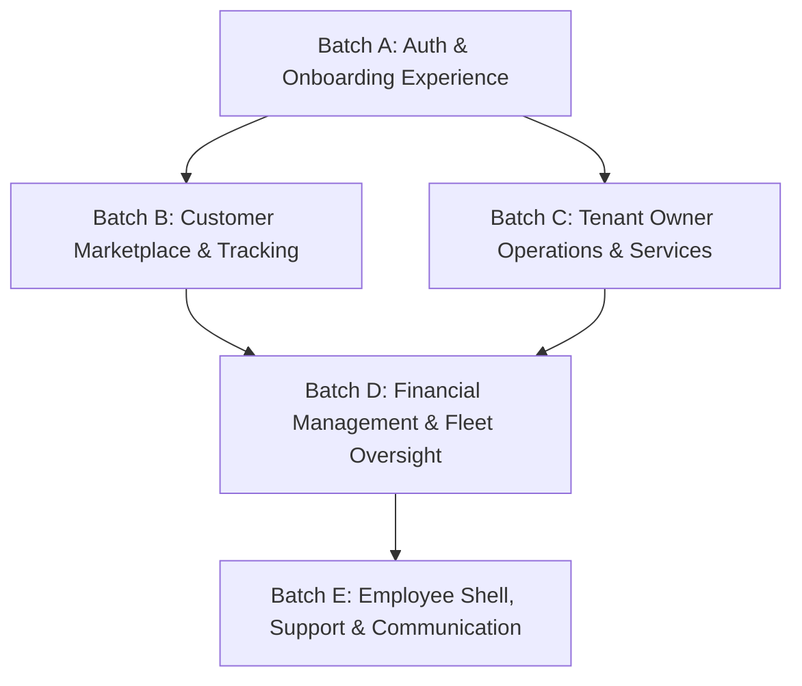

# Stitch Visual Design Brief Comparison & Gap Audit

> **Date**: August 17, 2026  
> **Status**: AUDIT COMPLETE (Read-Only Pass — Implementation Sequenced in Subsequent Batches)  
> **Reference Brief**: `design/stitch-export/quick_delivery_ui_brief/` (Google Stitch Visual Design Export — 18 Screen Folders & `velocity_logistics/DESIGN.md`)  
> **Target Scope**: All 28 screens in [`frontend/lib/screens/`](../../frontend/lib/screens/)  

---

## 1. Executive Summary

A comprehensive visual gap audit was performed comparing the Google Stitch design brief (`design/stitch-export/quick_delivery_ui_brief/`) against the 28 active Flutter screens in [`frontend/lib/screens/`](../../frontend/lib/screens/). 

Following the successful completion of Phase 26 (Design Token & Component Consistency Audit across Batches 1–5), all screens now strictly adhere to canonical design tokens (`AppColors`, `AppSpacing`, `AppRadius`, `AppTypography`, `AppElevation`, `AppMotion`). However, the new Stitch visual brief introduces refined component compositions, enhanced visual hierarchy (Bento-style grids, metric hero cards, and 2-point route connectors), a high-visibility **Amber Gold primary CTA button** design language, dedicated category filter chips, and modernized mobile interaction patterns.

This audit catalogs **65 concrete, numbered findings** across the 17 directly mapped screen pairs, establishes design extrapolation rules for the **11 screens without direct Stitch counterparts**, verifies confirmed architectural constraints, and proposes a 5-batch phased implementation roadmap (Batches A–E).

### Summary Audit Metrics
* **Total Current Flutter Screens Audited**: 28
* **Total Stitch Export Folders**: 18
* **Directly Mapped Screen Pairs Evaluated**: 17
* **Screens with Extrapolated Styling**: 11
* **Explicitly Deferred Stitch Screens**: 1 (`courier_profile`)
* **Total Concrete Actionable Findings**: 65
* **Proposed Implementation Batches**: 5 (Batches A–E)

---

## 2. Core Visual & Design System Differences

The Stitch visual export (`velocity_logistics/DESIGN.md`) builds on the Quick Delivery brand kit while establishing distinct ergonomic and visual priorities:

| Design Dimension | Current Implementation (`theme.dart` / Current Screens) | Stitch Visual Brief (`quick_delivery_ui_brief`) | Key Difference & Remediation Strategy |
| :--- | :--- | :--- | :--- |
| **Primary CTA Color** | Deep Navy (`AppColors.primary` `#0D1321`) with White text (`AppColors.onPrimary`) | Amber Gold (`#FFC107` / `secondary-container`) with Deep Navy text (`#0D1321`) | Stitch establishes Amber Gold as the high-visibility accent for key conversions ("Order Now", "Create Account", "Login", "Verify", "Accept Job"). |
| **Card Hierarchy** | Uniform elevation (`ThemedCard`, `level1`/`level2`) with standard 12dp radius | Asymmetric Bento-grid cards, dark hero metric containers (`bg-primary-container`), and decorative subtle corner accents | Introduce asymmetric Bento groupings for dashboards and hero cards with high-contrast numbers (`AppTypography.displayLg` 48pt). |
| **Input Fields** | Floating top labels inside `ThemedTextField` with 8dp radius | Static label above input field (`label-lg`), leading icon, 1.5px border (`border-outline-variant`), and focus state with 2px navy outline | Retain `ThemedTextField` token consistency while supporting static header label rows (e.g. Password + "Forgot password?" inline). |
| **Filter Controls** | Embedded dropdowns or tab bars | Horizontal scrollable pill filter chips (`h-10 px-5 rounded-full`) with filled active and outlined inactive states | Adopt pill filter chips across list and history screens ("All", "Active", "Completed", "Cancelled"). |
| **OTP Entry** | Single text field with letter spacing (8dp) | 6 discrete square digit input boxes (`w-12 h-14 rounded-lg border-1.5`) with auto-advance | Implement discrete 6-digit PIN input widget to streamline OTP entry and reduce input errors. |
| **Route Visualization** | Coordinate text strings or plain destination rows | 2-point vertical line connector with distinct pickup (dark) and drop-off (red) indicators and dock/bay notes | Standardize route timeline presentation widget across customer and employee job views. |

---

## 3. Screen-by-Screen Visual Comparison (17 Mapped Pairs)

### Pair 1: `login` vs `login_screen.dart`
* **Reference**: [`design/stitch-export/quick_delivery_ui_brief/login/`](../../design/stitch-export/quick_delivery_ui_brief/login/) (`code.html`, `screen.png`)
* **Target**: [`frontend/lib/screens/login_screen.dart`](../../frontend/lib/screens/login_screen.dart)

* **Finding 1.1** [`layout-composition`]: Current screen places all branding inside the card. Stitch introduces an external centered headline "Welcome Back" (`AppTypography.headlineLgMobile` 28px/semibold) and subtitle "Log in to manage your deliveries efficiently." (`AppTypography.bodyMd`) positioned above the card container.
* **Finding 1.2** [`layout-composition`]: "Forgot Password?" link is currently rendered below the password field as a full-width row alignment; Stitch places it compactly in the header row adjacent to the "Password" label.
* **Finding 1.3** [`color-usage` / `button-styling`]: The "Login" submit button uses Deep Navy fill; Stitch specifies Amber Gold fill (`AppColors.secondary` / `#FFC107`) with Deep Navy text (`AppColors.onSecondary` / `#0D1321`) and `active:scale-95` tap feedback.
* **Finding 1.4** [`layout-composition`]: "Don't have an account? Sign Up" is currently inside the card; Stitch positions it below the card container against the scaffold background.

---

### Pair 2: `signup` vs `signup_screen.dart`
* **Reference**: [`design/stitch-export/quick_delivery_ui_brief/signup/`](../../design/stitch-export/quick_delivery_ui_brief/signup/) (`code.html`, `screen.png`)
* **Target**: [`frontend/lib/screens/signup_screen.dart`](../../frontend/lib/screens/signup_screen.dart)

* **Finding 2.1** [`component-styling` / `ux-improvement`]: Role selection currently uses a standard `DropdownButtonFormField`; Stitch uses prominent visual selectable tile cards (Customer with `person` icon, Business with `storefront` icon), providing superior affordance and single-tap selection.
* **Finding 2.2** [`color-usage` / `button-styling`]: "Create Account" submit button uses Deep Navy fill; Stitch specifies Amber Gold primary fill (`AppColors.secondary`) with Deep Navy text.
* **Finding 2.3** [`layout-composition`]: "Already have an account? Log In" navigation link is currently inside the card; Stitch places it outside the card on the scaffold background.
* **Finding 2.4** [`typography-treatment`]: Header headline and subtitle hierarchy in Stitch uses tighter vertical stack spacing (`stack-sm` 8px / `stack-lg` 24px) with `headline-lg-mobile` (28px).

---

### Pair 3: `verify_otp` vs `otp_screen.dart`
* **Reference**: [`design/stitch-export/quick_delivery_ui_brief/verify_otp/`](../../design/stitch-export/quick_delivery_ui_brief/verify_otp/) (`code.html`, `screen.png`)
* **Target**: [`frontend/lib/screens/otp_screen.dart`](../../frontend/lib/screens/otp_screen.dart)

* **Finding 3.1** [`component-styling` / `ux-improvement`]: OTP input uses a single text input with artificial letter spacing; Stitch specifies 6 individual discrete square digit input boxes (`w-12 h-14`) with auto-focus, auto-advance, and error highlighting.
* **Finding 3.2** [`layout-composition`]: Resend OTP action in the current screen is a large outlined button below the submit button; Stitch places it as an inline text prompt with active countdown timer ("Didn't receive code? Resend in 0:42") above the primary CTA.
* **Finding 3.3** [`color-usage` / `button-styling`]: "Verify" submit button uses Deep Navy fill; Stitch specifies full-width Amber Gold secondary fill (`AppColors.secondary`) with Deep Navy text.
* **Finding 3.4** [`typography-treatment`]: Destination email callout uses inline bold emphasis (`font-bold text-primary`) rather than a multiline paragraph.

---

### Pair 4: `forgot_password` vs `forgot_password_screen.dart`
* **Reference**: [`design/stitch-export/quick_delivery_ui_brief/forgot_password/`](../../design/stitch-export/quick_delivery_ui_brief/forgot_password/) (`code.html`, `screen.png`)
* **Target**: [`frontend/lib/screens/forgot_password_screen.dart`](../../frontend/lib/screens/forgot_password_screen.dart)

* **Finding 4.1** [`component-styling` / `ux-improvement`]: OTP input field within the single-step reset form uses a single text input; Stitch specifies a 6-digit box grid with an inline "Resend OTP" link directly in the section label header row.
* **Finding 4.2** [`layout-composition` / `iconography`]: Submit button features a trailing forward arrow icon ("Update Password ->") in Amber Gold fill; "Back to Login" is styled as an inline text navigation link with leading arrow icon (`arrow_back`).
* **Finding 4.3** [`color-usage` / `button-styling`]: Primary submit button uses Deep Navy; Stitch specifies Amber Gold fill with Deep Navy text.

---

### Pair 5: `customer_home` vs `customer_home_screen.dart`
* **Reference**: [`design/stitch-export/quick_delivery_ui_brief/customer_home/`](../../design/stitch-export/quick_delivery_ui_brief/customer_home/) (`code.html`, `screen.png`)
* **Target**: [`frontend/lib/screens/customer_home_screen.dart`](../../frontend/lib/screens/customer_home_screen.dart)

* **Finding 5.1** [`layout-composition` / `ux-improvement`]: Stitch provides a prominent "Quick Booking" location input module (Pickup Location -> Drop-off Location -> "Find Couriers" button) at the top of the Home tab, providing immediate booking utility.
* **Finding 5.2** [`component-styling`]: Quick access category tiles in Stitch use circular icon buttons with subtle shadow and label below, providing a lighter visual density than full-height rectangular cards.
* **Finding 5.3** [`layout-composition` / `ux-improvement`]: Active shipment card in Stitch includes a live progress track (Pickup / ETA / Drop-off) and driver mini-profile (avatar, star rating, call action), significantly improving immediate glanceability over simple status text.
* **Finding 5.4** [`component-styling`]: Promo offer banner in Stitch uses a rich dark navy gradient (`from-primary-container to-[#1a2235]`) with gift icon and subtle pattern texture, giving higher visual polish than flat primary cards.

---

### Pair 6: `orders_history` vs `customer_jobs_screen.dart`
* **Reference**: [`design/stitch-export/quick_delivery_ui_brief/orders_history/`](../../design/stitch-export/quick_delivery_ui_brief/orders_history/) (`code.html`, `screen.png`)
* **Target**: [`frontend/lib/screens/customer_jobs_screen.dart`](../../frontend/lib/screens/customer_jobs_screen.dart)

* **Finding 6.1** [`layout-composition` / `ux-improvement`]: Missing horizontal category/status pill filter chips ("All", "In Transit", "Completed", "Cancelled") to quickly filter orders.
* **Finding 6.2** [`component-styling` / `ux-improvement`]: Stitch provides contextual action buttons inside order cards based on status: Amber "Track" button with `my_location` icon for active/in-transit jobs, outlined "Reorder" button with `replay` icon for completed jobs, and "Details" for cancelled jobs.
* **Finding 6.3** [`typography-treatment` / `layout-composition`]: Card header groups the date/timestamp above the Order ID, with status badge top-right, creating clean visual balance.
* **Finding 6.4** [`iconography`]: Destination address includes categorized circular icons (`location_on`, `home`, `business`) for visual anchor.

---

### Pair 7: `job_details` vs `job_status_screen.dart`
* **Reference**: [`design/stitch-export/quick_delivery_ui_brief/job_details/`](../../design/stitch-export/quick_delivery_ui_brief/job_details/) (`code.html`, `screen.png`)
* **Target**: [`frontend/lib/screens/job_status_screen.dart`](../../frontend/lib/screens/job_status_screen.dart)

* **Finding 7.1** [`layout-composition` / `ux-improvement`]: Stitch features an integrated map preview header (30-40vh) with floating status pill at the top of the job details view, creating immediate spatial awareness.
* **Finding 7.2** [`layout-composition` / `ux-improvement`]: Route Details section uses an address timeline with detailed pickup and drop-off instructions callout boxes and direct "Call" action.
* **Finding 7.3** [`component-styling`]: Bottom action bar is fixed and floating at the bottom with a dedicated Chat icon button beside the primary progression action, saving vertical scroll space.
* **Finding 7.4** [`scope-mapping-flag`]: Note on role perspective: Stitch `job_details` displays courier-specific earnings and progression buttons ("Arrived at Pickup"), while our `job_status_screen.dart` is customer-focused with price negotiation and cancellation options. The visual layout (Map header, Route timeline, bottom floating bar) should be adapted to our customer status model.

---

### Pair 8: `owner_dashboard` vs `home_screen.dart` (Owner Home Tab)
* **Reference**: [`design/stitch-export/quick_delivery_ui_brief/owner_dashboard/`](../../design/stitch-export/quick_delivery_ui_brief/owner_dashboard/) (`code.html`, `screen.png`)
* **Target**: [`frontend/lib/screens/home_screen.dart`](../../frontend/lib/screens/home_screen.dart)

* **Finding 8.1** [`layout-composition` / `ux-improvement`]: Stitch organizes key metrics into an asymmetric Bento grid (large Wallet balance card with weekly trend + stacked dark Subscription tier card & Active Jobs count), providing clearer visual hierarchy than equal-sized stat cards.
* **Finding 8.2** [`component-styling`]: Subscription metric tile uses a dark navy container (`AppColors.primary`) with gold star icon and "Active" status pill, making the owner's plan tier immediately prominent.
* **Finding 8.3** [`layout-composition`]: Quick Actions section provides a 4-item grid with distinct soft-colored circular icon backgrounds (Manage Employees, Wallet, Subscription, Fleet Map).
* **Finding 8.4** [`typography-treatment`]: Large wallet metric in Stitch uses `AppTypography.displayLg` (48pt bold) with distinct fractional cent sizing (`.00` in smaller type), adding financial app polish.

---

### Pair 9: `manage_employees` vs `employee_screen.dart`
* **Reference**: [`design/stitch-export/quick_delivery_ui_brief/manage_employees/`](../../design/stitch-export/quick_delivery_ui_brief/manage_employees/) (`code.html`, `screen.png`)
* **Target**: [`frontend/lib/screens/employee_screen.dart`](../../frontend/lib/screens/employee_screen.dart)

* **Finding 9.1** [`layout-composition` / `ux-improvement`]: Stitch provides a search bar ("Search employees by name or ID") and status filter chips ("All", "Active", "Frozen") for quickly filtering the employee roster.
* **Finding 9.2** [`component-styling` / `ux-improvement`]: Employee cards include direct status toggle switches (`Switch`), streamlining the activation/freeze action compared to the current multi-field dropdown form.
* **Finding 9.3** [`layout-composition`]: Registration and audit log workflows can be presented via modal dialogs or secondary actions, keeping the main tab focused on the employee roster.
* **Finding 9.4** [`typography-treatment`]: Worker card typography uses `titleMd` for employee name, `bodyMd` for ID, and `labelSm` with colored dot for status.

---

### Pair 10: `employee_jobs` vs `employee_jobs_screen.dart`
* **Reference**: [`design/stitch-export/quick_delivery_ui_brief/employee_jobs/`](../../design/stitch-export/quick_delivery_ui_brief/employee_jobs/) (`code.html`, `screen.png`)
* **Target**: [`frontend/lib/screens/employee_jobs_screen.dart`](../../frontend/lib/screens/employee_jobs_screen.dart)

* **Finding 10.1** [`layout-composition` / `ux-improvement`]: Job cards in Stitch feature a 2-point vertical route timeline showing pickup and drop-off points with specific bay/dock details and a metrics row (Distance, Time, Cargo pallets/boxes) with vertical dividers.
* **Finding 10.2** [`typography-treatment` / `color-usage`]: Estimated earnings / fare is rendered in bold Amber Gold (`AppColors.secondary` / `text-secondary-fixed-dim`) in the top right of each job card.
* **Finding 10.3** [`component-styling`]: Primary job action button ("Accept Job" / "Complete Job") is styled in Amber Gold fill with Deep Navy text across all states.
* **Finding 10.4** [`layout-composition`]: In `employee_jobs_screen.dart`, the Action Simulator is demoted below active jobs; Stitch focuses the feed entirely on actionable job cards.

---

### Pair 11: `owner_configuration` vs `owner_configuration_screen.dart`
* **Reference**: [`design/stitch-export/quick_delivery_ui_brief/owner_configuration/`](../../design/stitch-export/quick_delivery_ui_brief/owner_configuration/) (`code.html`, `screen.png`)
* **Target**: [`frontend/lib/screens/owner_configuration_screen.dart`](../../frontend/lib/screens/owner_configuration_screen.dart)

* **Finding 11.1** [`component-styling` / `ux-improvement`]: Image upload area in Stitch uses a styled 2:1 aspect ratio dashed preview card with subtle overlay and centered `add_a_photo` icon, providing clearer visual guidance than a standalone button.
* **Finding 11.2** [`layout-composition`]: Pricing fields (Base Price and Price-per-km) are placed side-by-side in a balanced 2-column grid with explicit currency prefix symbol.
* **Finding 11.3** [`component-styling`]: Location readout card is styled in a tinted container (`bg-surface-container-low`) with monospace coordinates typography (`font-mono`) and pin icon.
* **Finding 11.4** [`button-styling`]: "Set Location on Map" is a full-width outlined button with `map` icon, matching the secondary button design token.

---

### Pair 12: `wallet_owner` vs `wallet_screen.dart`
* **Reference**: [`design/stitch-export/quick_delivery_ui_brief/wallet_owner/`](../../design/stitch-export/quick_delivery_ui_brief/wallet_owner/) (`code.html`, `screen.png`)
* **Target**: [`frontend/lib/screens/wallet_screen.dart`](../../frontend/lib/screens/wallet_screen.dart)

* **Finding 12.1** [`layout-composition` / `ux-improvement`]: Balance Hero Card in Stitch uses a dark navy container with high-contrast Amber Gold total balance and embedded 2-column withdrawable/escrow split separated by a subtle divider.
* **Finding 12.2** [`component-styling` / `button-styling`]: Action buttons are styled side-by-side with high-contrast Amber Gold "Withdraw" (`download` icon) and outlined "Deposit" (`upload` icon).
* **Finding 12.3** [`layout-composition` / `iconography`]: Transaction ledger entries in Stitch feature directional circular icons (`arrow_downward` for incoming payments, `arrow_upward` for bank withdrawals), title with Job ID, timestamp, and colored amount.
* **Finding 12.4** [`typography-treatment`]: Balance headline uses `displayLg` with fractional decimals (`.00`) rendered in secondary font size.

---

### Pair 13: `owner_subscription` vs `subscription_screen.dart`
* **Reference**: [`design/stitch-export/quick_delivery_ui_brief/owner_subscription/`](../../design/stitch-export/quick_delivery_ui_brief/owner_subscription/) (`code.html`, `screen.png`)
* **Target**: [`frontend/lib/screens/subscription_screen.dart`](../../frontend/lib/screens/subscription_screen.dart)

* **Finding 13.1** [`component-styling` / `ux-improvement`]: Professional tier card in Stitch is visually emphasized using a dark navy container (`bg-primary-container`), top Amber Gold "Best Value" ribbon, and gold checkmarks, creating strong tier distinction.
* **Finding 13.2** [`layout-composition`]: Feature lists in each subscription card use bulleted checkmark rows (`check` / `check_circle` icons) with clear plan limits.
* **Finding 13.3** [`button-styling`]: Primary upgrade button uses Amber Gold secondary fill; current plan uses outlined disabled button.
* **Finding 13.4** [`typography-treatment`]: Pricing display shows prominent amount (`$49`) with `/mo` suffix in `bodyMd`.

---

### Pair 14: `settings_owner` vs `settings_screen.dart`
* **Reference**: [`design/stitch-export/quick_delivery_ui_brief/settings_owner/`](../../design/stitch-export/quick_delivery_ui_brief/settings_owner/) (`code.html`, `screen.png`)
* **Target**: [`frontend/lib/screens/settings_screen.dart`](../../frontend/lib/screens/settings_screen.dart)

* **Finding 14.1** [`layout-composition` / `ux-improvement`]: Stitch adds a top Profile Summary card (user avatar, full name, role badge "Owner" / "Employee" / "Customer") giving personal identity to the settings screen.
* **Finding 14.2** [`component-styling`]: Grouped settings items in Stitch are encapsulated in rounded container cards (`bg-surface-container-low`) with subtle dividers, trailing value labels, and navigation chevrons (`chevron_right`).
* **Finding 14.3** [`component-styling`]: KYC/KYB Status row includes an inline localized status pill ("Verified", "Pending", "Action Required") adjacent to the chevron.
* **Finding 14.4** [`button-styling`]: Logout row uses red text and logout icon in a dedicated container row with subtle hover/active highlight.

---

### Pair 15: `kyc_kyb_upload` vs `kyc_document_upload_screen.dart`
* **Reference**: [`design/stitch-export/quick_delivery_ui_brief/kyc_kyb_upload/`](../../design/stitch-export/quick_delivery_ui_brief/kyc_kyb_upload/) (`code.html`, `screen.png`)
* **Target**: [`frontend/lib/screens/kyc_document_upload_screen.dart`](../../frontend/lib/screens/kyc_document_upload_screen.dart)

* **Finding 15.1** [`layout-composition` / `ux-improvement`]: Stitch organizes document slots into a compact 2x2 responsive card grid, reducing vertical scrolling on desktop/tablet while maintaining clear slot visibility.
* **Finding 15.2** [`component-styling` / `ux-improvement`]: Empty/actionable document slots use a dashed 2px border with a centered circular camera icon (`add_a_photo`) and clear "Tap to capture or upload" call to action.
* **Finding 15.3** [`component-styling`]: Status-specific visual treatments (green corner accent for Approved, animated spinning sync icon for Pending, red callout for Rejected) give immediate per-document feedback.
* **Finding 15.4** [`typography-treatment`]: Slot title and subtitle use `labelLg` and `labelSm` for compact card presentation.

---

### Pair 16: `fleet_map` vs `owner_fleet_map_screen.dart`
* **Reference**: [`design/stitch-export/quick_delivery_ui_brief/fleet_map/`](../../design/stitch-export/quick_delivery_ui_brief/fleet_map/) (`code.html`, `screen.png`)
* **Target**: [`frontend/lib/screens/owner_fleet_map_screen.dart`](../../frontend/lib/screens/owner_fleet_map_screen.dart)

* **Finding 16.1** [`component-styling` / `iconography`]: Map pins in Stitch are differentiated by vehicle type (`local_shipping` vs `two_wheeler`) with pulsating live rings and floating name tooltips.
* **Finding 16.2** [`component-styling` / `ux-improvement`]: Floating map control cluster (Zoom In, Zoom Out, Recenter) in top right corner provides clear map navigation controls.
* **Finding 16.3** [`layout-composition` / `ux-improvement`]: Selected driver bottom floating card provides rich delivery context: driver avatar, rating score, active job ID, progress bar with ETA, and dual quick actions ("View Route", "Message").
* **Finding 16.4** [`component-styling`]: Bottom sheet features a mobile drag handle indicator and rounded corners (`AppRadius.xl`).

---

### Pair 17: `fleet_history` vs `owner_history_screen.dart` (Completed Jobs Section)
* **Reference**: [`design/stitch-export/quick_delivery_ui_brief/fleet_history/`](../../design/stitch-export/quick_delivery_ui_brief/fleet_history/) (`code.html`, `screen.png`)
* **Target**: [`frontend/lib/screens/owner_history_screen.dart`](../../frontend/lib/screens/owner_history_screen.dart)

* **Finding 17.1** [`layout-composition` / `ux-improvement`]: Stitch adds a top search input and horizontal filter chips ("All", "Today", "Completed", "Cancelled") for rapid fleet history lookup.
* **Finding 17.2** [`component-styling`]: Job history cards include category icons (`package_2`, `directions_car`), a 2-column info grid for schedule and driver assignment, and prominent right-aligned fare typography.
* **Finding 17.3** [`component-styling`]: Status badges use distinct color fills and typography (green for Completed, amber with pulsing dot for Active/En Route, red container with strikethrough for Cancelled).
* **Finding 17.4** [`scope-constraint-note`]: Bottom nav in Stitch mockup displays "Services" as the 2nd tab; per confirmed constraint, our app preserves "Employees" as the 2nd tab label and scope.

---

## 4. Stylistic Extrapolation Guide (11 Screens Without Direct Stitch Mockup)

For the 11 screens that do not have a dedicated Stitch folder, this section identifies the closest mapped Stitch reference screen and defines extrapolation rules to ensure architectural and visual consistency:

| Screen File | Functional Purpose | Closest Stitch Stylistic Match | Concrete Extrapolation & Styling Rules |
| :--- | :--- | :--- | :--- |
| **`chat_screen.dart`** | Real-time WebSocket messaging thread per job | `job_details` (bottom bar) & `settings_owner` (containers) | Use `bg-surface-container-low` for incoming bubbles, `bg-primary text-on-primary` for outgoing bubbles. Style message input row after `job_details` floating bar with 8dp radius input and Amber Gold send icon. |
| **`customer_job_map_screen.dart`** | Customer live tracking of assigned courier | `fleet_map` & `job_details` | Mirror `fleet_map` floating controls (zoom, re-center), pulsating vehicle marker pins, and floating bottom driver card with avatar, ETA progress bar, and "Message" button. |
| **`customer_marketplace_screen.dart`** | Services directory with search & map picker | `customer_home` & `manage_employees` | Adopt `manage_employees` search bar and pill category filter chips (Delivery, Ride, Shipping). Style service cards using `ThemedCard` with thumbnail, base/km price readout, and Amber Gold booking CTA button. |
| **`employee_history_screen.dart`** | Worker's completed & cancelled jobs history | `fleet_history` & `orders_history` | Mirror `fleet_history` card structure: Job ID, category icon, 2-column info grid (completion timestamp, payment method/escrow), status pill badge, and right-aligned fare typography. |
| **`employee_home_screen.dart`** | Tabbed shell for employee role | `customer_home` & `owner_dashboard` | Standardize transparent header (QD logo, bell icon with unread badge) and 3-tab `NavigationBar` (Home, History, Settings) matching the 4-tab owner/customer navigation chrome. |
| **`my_account_screen.dart`** | Customer profile view & edit (name, phone, addresses) | `settings_owner` & `owner_configuration` | Top profile summary card with avatar and role badge ("Customer"). Form cards for username, email, phone, and saved addresses with 1.5px input borders, prefix icons (`badge`, `mail`, `phone`), and Amber Gold save button. |
| **`notifications_screen.dart`** | SSE notifications list with category filters | `orders_history` & `customer_home` | Category filter chips (All, Jobs, System, Alerts), chronological group headers (Today, Yesterday, Earlier), dismissible notification cards with category icon, timestamp, unread indicator dot, and deep-link action button. |
| **`owner_reconciliation_queue_screen.dart`** | Stuck escrow manual review & resolution queue | `fleet_history` & `manage_employees` | Queue cards with Job ID, human-readable failure reason mapping banner (amber warning container), locked escrow amount, notes, and dual action buttons (Amber "Release to Employee" / Outlined "Refund to Customer"). |
| **`rating_screen.dart`** | Blind 1–5 star rating and comment submission | `job_details` & `customer_home` (driver mini-card) | Partner avatar card with job context, 5-star interactive rating selector in Amber Gold (`#FFC107`), comment input field with character limit, and Amber Gold primary submit button. |
| **`service_screen.dart`** | Owner service listings and service creation form | `owner_configuration` & `manage_employees` | Service item cards with category icon, pricing details (base price + rate per km), coordinates display, and create service modal/form styled after `owner_configuration`. |
| **`update_required_screen.dart`** | App version gating / forced update screen | `login` & `verify_otp` | Centered card layout with app logo/icon, headline title, version update description, and high-contrast Amber Gold primary update button. |

---

## 5. Confirmed Architectural Constraints & Scope Verification

The following constraints were strictly verified during this audit:

1. **Owner Navigation Tab Scope**:
   * **Constraint**: The Owner's 2nd bottom navigation tab remains labeled and scoped as **"Employees"** (`Icons.groups`, worker roster and management), NOT "Services" (even though the Stitch `fleet_history` mockup nav bar shows "Services").
   * **Audit Result**: Verified. All recommendations adapt Stitch's visual styling to our existing 4-tab Owner structure (`Home`, `Employees`, `History`, `Settings`).
2. **Courier Profile Screen Scope**:
   * **Constraint**: Do NOT create or add a new "Courier Profile" screen — Stitch's `courier_profile` mockup is explicitly deferred and out of scope.
   * **Audit Result**: Verified. `courier_profile` was audited for reference design cues (e.g. driver avatar card styling in `rating_screen.dart` and `customer_job_map_screen.dart`) but is excluded from implementation deliverables.

---

## 6. Mapping Nuances & Flags

During the line-by-line comparison, one key mapping nuance was identified:

* **Stitch `job_details` vs `job_status_screen.dart`**:
  * **Nuance**: Stitch `job_details` is titled "Job Details - QD Logistics" and includes courier-facing actions ("Arrived at Pickup ->", "Earnings: $18.50"), representing an active job execution detail screen. In our architecture, `job_status_screen.dart` is the customer-facing job tracking and status progression screen (with price negotiation, 3-step progress stepper, cancellation, and rating entry point), while `employee_jobs_screen.dart` renders active assigned jobs for couriers directly inline on the Employee tab.
  * **Resolution**: The mapping to `job_status_screen.dart` is structurally correct as the central "single job status & tracking details" screen. However, the visual treatment (Map header, Route timeline, bottom floating bar) should be adapted to the customer tracking model, while informing courier card details in `employee_jobs_screen.dart`.

---

## 7. Prioritized Implementation Batch Plan

To execute these visual design enhancements safely without monolithic regressions, the work is organized into **5 discrete, dependency-ordered batches** matching the discipline of Phase 26:

### Proposed Batch Groupings

* **Batch A: Authentication & Onboarding Experience** (5 screens):
  * `login_screen.dart`
  * `signup_screen.dart`
  * `otp_screen.dart`
  * `forgot_password_screen.dart`
  * `update_required_screen.dart`
  * *Focus*: Amber Gold primary CTAs, discrete 6-digit PIN input, visual role selector cards, external headline hierarchy.

* **Batch B: Customer Marketplace & Tracking Experience** (5 screens):
  * `customer_home_screen.dart`
  * `customer_jobs_screen.dart`
  * `customer_marketplace_screen.dart`
  * `job_status_screen.dart`
  * `customer_job_map_screen.dart`
  * *Focus*: Top Quick Booking widget, pill filter chips, contextual order action buttons, map preview header, route timeline.

* **Batch C: Tenant Owner Operations & Services** (5 screens):
  * `home_screen.dart` (Owner Dashboard Tab)
  * `employee_screen.dart`
  * `owner_configuration_screen.dart`
  * `service_screen.dart`
  * `kyc_document_upload_screen.dart`
  * *Focus*: Asymmetric Bento metrics grid, inline worker status toggles, 2:1 aspect ratio dashed photo uploader, 2x2 KYC document grid.

* **Batch D: Financial Management & Fleet Oversight** (5 screens):
  * `wallet_screen.dart`
  * `subscription_screen.dart`
  * `owner_fleet_map_screen.dart`
  * `owner_history_screen.dart`
  * `owner_reconciliation_queue_screen.dart`
  * *Focus*: Dark Navy Balance Hero Card, side-by-side withdraw/deposit actions, highlighted Professional tier card, floating map controls & driver details sheet.

* **Batch E: Employee Shell, Support & Communication** (8 screens):
  * `employee_home_screen.dart`
  * `employee_jobs_screen.dart`
  * `employee_history_screen.dart`
  * `settings_screen.dart`
  * `my_account_screen.dart`
  * `notifications_screen.dart`
  * `chat_screen.dart`
  * `rating_screen.dart`
  * *Focus*: Employee route timeline cards, Profile Summary header in Settings, categorized grouped settings cards, message bubble refinement, gold star rating selector.

---

## 8. Summary Table of Findings per Screen

| # | Screen File | Direct Stitch Match | Finding Count | Key Visual Upgrades |
| :-: | :--- | :--- | :-: | :--- |
| 1 | `login_screen.dart` | `login` | 4 | External headline, inline forgot link, Amber Gold CTA, external signup link |
| 2 | `signup_screen.dart` | `signup` | 4 | Visual 2-card role selector, Amber Gold CTA, external login link, spacing |
| 3 | `otp_screen.dart` | `verify_otp` | 4 | 6 discrete PIN boxes, inline countdown resend, Amber Gold CTA, email emphasis |
| 4 | `forgot_password_screen.dart` | `forgot_password` | 3 | 6 discrete PIN boxes, inline resend link, Amber Gold CTA with forward arrow |
| 5 | `customer_home_screen.dart` | `customer_home` | 4 | Quick Booking module, circular category chips, live progress card, promo banner |
| 6 | `customer_jobs_screen.dart` | `orders_history` | 4 | Status filter chips, contextual action buttons (Track/Reorder/Details), date hierarchy |
| 7 | `job_status_screen.dart` | `job_details` | 4 | Map preview header, route details timeline, bottom floating action bar |
| 8 | `home_screen.dart` | `owner_dashboard` | 4 | Bento metrics grid, dark subscription tier card, 4-item quick actions, 48pt balance |
| 9 | `employee_screen.dart` | `manage_employees` | 4 | Search bar, status filter chips, inline status toggle switch, typography |
| 10 | `employee_jobs_screen.dart` | `employee_jobs` | 4 | 2-point route timeline, Est. Earnings highlight, Amber Gold CTA, feed focus |
| 11 | `owner_configuration_screen.dart` | `owner_configuration` | 4 | 2:1 dashed photo uploader, 2-column pricing grid, mono coordinates card |
| 12 | `wallet_screen.dart` | `wallet_owner` | 4 | Dark Balance Hero Card, side-by-side actions, directional ledger icons |
| 13 | `subscription_screen.dart` | `owner_subscription` | 4 | Dark Navy Professional tier card with Best Value ribbon, checkmark lists |
| 14 | `settings_screen.dart` | `settings_owner` | 4 | Profile Summary header card, grouped container cards with chevrons, status pills |
| 15 | `kyc_document_upload_screen.dart` | `kyc_kyb_upload` | 4 | 2x2 document card grid, dashed empty slots, status corner accents |
| 16 | `owner_fleet_map_screen.dart` | `fleet_map` | 4 | Vehicle type pins with pulse ring, floating map controls, floating driver sheet |
| 17 | `owner_history_screen.dart` | `fleet_history` | 4 | Top search & filter chips, category icons, 2-column schedule/driver grid |
| 18 | `chat_screen.dart` | *Extrapolated* | - | Bottom floating bar styling, container bubbles |
| 19 | `customer_job_map_screen.dart` | *Extrapolated* | - | Floating controls, vehicle pins, driver card |
| 20 | `customer_marketplace_screen.dart`| *Extrapolated* | - | Search bar, pill category chips, styled service cards |
| 21 | `employee_history_screen.dart` | *Extrapolated* | - | Fleet history card structure, status badges |
| 22 | `employee_home_screen.dart` | *Extrapolated* | - | Unified navigation chrome, transparent header |
| 23 | `my_account_screen.dart` | *Extrapolated* | - | Profile summary card, structured form cards |
| 24 | `notifications_screen.dart` | *Extrapolated* | - | Category filter chips, chronological headers |
| 25 | `owner_reconciliation_queue_screen.dart` | *Extrapolated* | - | Failure reason banner, dual release/refund actions |
| 26 | `rating_screen.dart` | *Extrapolated* | - | Driver avatar card, gold star selector, Amber CTA |
| 27 | `service_screen.dart` | *Extrapolated* | - | Configuration form card styling, category icons |
| 28 | `update_required_screen.dart` | *Extrapolated* | - | Centered card layout, Amber Gold CTA button |
| - | `courier_profile` | *Deferred* | - | Explicitly deferred per architectural constraint |
| **TOTAL** | **28 Screens** | **17 Mapped + 11 Extrapolated** | **65** | **Comprehensive visual modernization across all 28 screens** |
